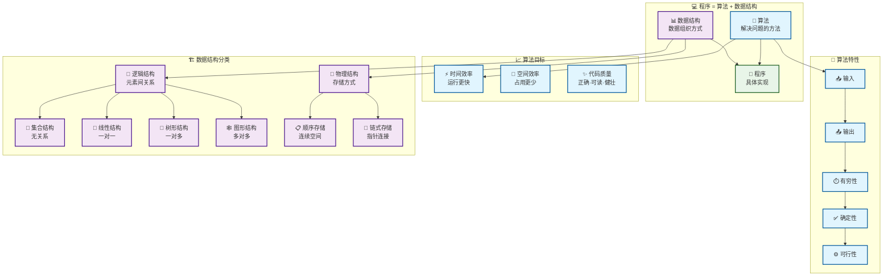

# 算法与数据结构

>《算法 + 数据结构 = 程序》 —— Pascal语言之父 Niklaus Emil Wirth

<svg viewBox="0 0 1400 500" xmlns="http://www.w3.org/2000/svg" style="max-width: 100%; height: auto; filter: drop-shadow(0 20px 40px rgba(0,0,0,0.1));">
    <defs>
        <linearGradient id="bgGradient" x1="0%" y1="0%" x2="100%" y2="100%">
            <stop offset="0%" style="stop-color:#ffffff;stop-opacity:0.95" />
            <stop offset="100%" style="stop-color:#f8fafc;stop-opacity:0.95" />
        </linearGradient>
        <linearGradient id="programGradient" x1="0%" y1="0%" x2="100%" y2="100%">
            <stop offset="0%" style="stop-color:#667eea" />
            <stop offset="100%" style="stop-color:#764ba2" />
        </linearGradient>
        <linearGradient id="dataGradient" x1="0%" y1="0%" x2="100%" y2="100%">
            <stop offset="0%" style="stop-color:#4facfe" />
            <stop offset="100%" style="stop-color:#00f2fe" />
        </linearGradient>
        <linearGradient id="algoGradient" x1="0%" y1="0%" x2="100%" y2="100%">
            <stop offset="0%" style="stop-color:#fa709a" />
            <stop offset="100%" style="stop-color:#fee140" />
        </linearGradient>
        <filter id="cardShadow" x="-20%" y="-20%" width="140%" height="140%">
            <feDropShadow dx="0" dy="8" stdDeviation="12" flood-color="#000" flood-opacity="0.15"/>
        </filter>
        <filter id="textShadow" x="-20%" y="-20%" width="140%" height="140%">
            <feDropShadow dx="0" dy="2" stdDeviation="4" flood-color="#000" flood-opacity="0.3"/>
        </filter>
    </defs>
    <rect x="30" y="30" width="1200" height="440" rx="30"
        fill="url(#bgGradient)"
        stroke="#e2e8f0"
        stroke-width="2"
        filter="url(#cardShadow)"/>
    <pattern id="grid" width="40" height="40" patternUnits="userSpaceOnUse">
        <path d="M 40 0 L 0 0 0 40" fill="none" stroke="#f1f5f9" stroke-width="1" opacity="0.2"/>
    </pattern>
    <rect x="30" y="30" width="1200" height="440" rx="30" fill="url(#grid)"/>
    <g transform="translate(80, 125)">
        <rect width="240" height="250" rx="25"
            fill="url(#programGradient)"
            filter="url(#cardShadow)"/>
        <rect x="0" y="0" width="240" height="80" rx="25"
            fill="rgba(255,255,255,0.15)"/>
        <text x="120" y="50"
            text-anchor="middle"
            font-family="'SF Pro Display', -apple-system, BlinkMacSystemFont, sans-serif"
            font-size="32"
            font-weight="bold"
            fill="#ffffff"
            filter="url(#textShadow)">程序</text>
        <g transform="translate(25, 100)">
            <g transform="translate(0, 0)">
                <circle cx="8" cy="8" r="4" fill="rgba(255,255,255,0.8)"/>
                <text x="25" y="14" font-family="'SF Pro Text', -apple-system, BlinkMacSystemFont, sans-serif" font-size="16" font-weight="500" fill="#ffffff">逻辑处理</text>
            </g>
            <g transform="translate(0, 30)">
                <circle cx="8" cy="8" r="4" fill="rgba(255,255,255,0.8)"/>
                <text x="25" y="14" font-family="'SF Pro Text', -apple-system, BlinkMacSystemFont, sans-serif" font-size="16" font-weight="500" fill="#ffffff">问题解决</text>
            </g>
            <g transform="translate(0, 60)">
                <circle cx="8" cy="8" r="4" fill="rgba(255,255,255,0.8)"/>
                <text x="25" y="14" font-family="'SF Pro Text', -apple-system, BlinkMacSystemFont, sans-serif" font-size="16" font-weight="500" fill="#ffffff">系统设计</text>
            </g>
            <g transform="translate(0, 90)">
                <circle cx="8" cy="8" r="4" fill="rgba(255,255,255,0.8)"/>
                <text x="25" y="14" font-family="'SF Pro Text', -apple-system, BlinkMacSystemFont, sans-serif" font-size="16" font-weight="500" fill="#ffffff">功能实现</text>
            </g>
        </g>
    </g>
    <g transform="translate(380, 250)">
        <circle cx="0" cy="0" r="30" fill="#ffffff" stroke="#e2e8f0" stroke-width="3" filter="url(#cardShadow)"/>
        <text x="0" y="12"
            text-anchor="middle"
            font-family="'SF Pro Display', -apple-system, BlinkMacSystemFont, sans-serif"
            font-size="32"
            font-weight="bold"
            fill="#64748b">=</text>
    </g>
    <g transform="translate(470, 125)">
        <rect width="280" height="250" rx="25"
            fill="url(#dataGradient)"
            filter="url(#cardShadow)"/>
        <rect x="0" y="0" width="280" height="80" rx="25"
            fill="rgba(255,255,255,0.15)"/>
        <text x="140" y="50"
            text-anchor="middle"
            font-family="'SF Pro Display', -apple-system, BlinkMacSystemFont, sans-serif"
            font-size="28"
            font-weight="bold"
            fill="#ffffff"
            filter="url(#textShadow)">数据结构</text>
        <g transform="translate(25, 100)">
            <g transform="translate(0, 0)">
                <circle cx="8" cy="8" r="4" fill="rgba(255,255,255,0.8)"/>
                <text x="25" y="14" font-family="'SF Pro Text', -apple-system, BlinkMacSystemFont, sans-serif" font-size="16" font-weight="500" fill="#ffffff">数组 Array</text>
            </g>
            <g transform="translate(0, 30)">
                <circle cx="8" cy="8" r="4" fill="rgba(255,255,255,0.8)"/>
                <text x="25" y="14" font-family="'SF Pro Text', -apple-system, BlinkMacSystemFont, sans-serif" font-size="16" font-weight="500" fill="#ffffff">链表 LinkedList</text>
            </g>
            <g transform="translate(0, 60)">
                <circle cx="8" cy="8" r="4" fill="rgba(255,255,255,0.8)"/>
                <text x="25" y="14" font-family="'SF Pro Text', -apple-system, BlinkMacSystemFont, sans-serif" font-size="16" font-weight="500" fill="#ffffff">栈 Stack / 队列 Queue</text>
            </g>
            <g transform="translate(0, 90)">
                <circle cx="8" cy="8" r="4" fill="rgba(255,255,255,0.8)"/>
                <text x="25" y="14" font-family="'SF Pro Text', -apple-system, BlinkMacSystemFont, sans-serif" font-size="16" font-weight="500" fill="#ffffff">哈希表 / 树 / 图</text>
            </g>
        </g>
    </g>
    <g transform="translate(800, 250)">
        <circle cx="0" cy="0" r="25" fill="#ffffff" stroke="#e2e8f0" stroke-width="3" filter="url(#cardShadow)"/>
        <text x="0" y="8"
            text-anchor="middle"
            font-family="'SF Pro Display', -apple-system, BlinkMacSystemFont, sans-serif"
            font-size="28"
            font-weight="bold"
            fill="#64748b">+</text>
    </g>
    <g transform="translate(890, 125)">
        <rect width="280" height="250" rx="25"
            fill="url(#algoGradient)"
            filter="url(#cardShadow)"/>
        <rect x="0" y="0" width="280" height="80" rx="25"
            fill="rgba(255,255,255,0.15)"/>
        <text x="140" y="50"
            text-anchor="middle"
            font-family="'SF Pro Display', -apple-system, BlinkMacSystemFont, sans-serif"
            font-size="28"
            font-weight="bold"
            fill="#ffffff"
            filter="url(#textShadow)">算法</text>
        <g transform="translate(25, 100)">
            <g transform="translate(0, 0)">
                <circle cx="8" cy="8" r="4" fill="rgba(255,255,255,0.8)"/>
                <text x="25" y="14" font-family="'SF Pro Text', -apple-system, BlinkMacSystemFont, sans-serif" font-size="16" font-weight="500" fill="#ffffff">排序 Sorting</text>
            </g>
            <g transform="translate(0, 30)">
                <circle cx="8" cy="8" r="4" fill="rgba(255,255,255,0.8)"/>
                <text x="25" y="14" font-family="'SF Pro Text', -apple-system, BlinkMacSystemFont, sans-serif" font-size="16" font-weight="500" fill="#ffffff">搜索 Searching</text>
            </g>
            <g transform="translate(0, 60)">
                <circle cx="8" cy="8" r="4" fill="rgba(255,255,255,0.8)"/>
                <text x="25" y="14" font-family="'SF Pro Text', -apple-system, BlinkMacSystemFont, sans-serif" font-size="16" font-weight="500" fill="#ffffff">递归 Recursion</text>
            </g>
            <g transform="translate(0, 90)">
                <circle cx="8" cy="8" r="4" fill="rgba(255,255,255,0.8)"/>
                <text x="25" y="14" font-family="'SF Pro Text', -apple-system, BlinkMacSystemFont, sans-serif" font-size="16" font-weight="500" fill="#ffffff">动态规划 / 贪心</text>
            </g>
        </g>
    </g>
</svg>

# 算法与数据结构入门指南

> **核心理念**：算法解决问题的方法，数据结构是数据组织方式


## 📊 整体概览



## 1. 数据结构

**定义**：具有特定结构特征的数据元素集合，关注数据的组织、存储和操作方式。

**作用**：提升计算机资源利用效率。例如：操作系统通过B+树索引快速定位文件，而非全盘扫描。

### 1.1 逻辑结构详解

**逻辑结构**：数据元素之间的相互关系

```mermaid
graph TB
    subgraph "🏗️ 数据逻辑结构"
        direction TB

        subgraph "🔵 集合结构 - 无关系"
            direction LR
            C1((A))
            C2((B))
            C3((C))
            C4((D))
            C5[元素互不相关<br/>类似数学集合]
        end

        subgraph "📏 线性结构 - 一对一"
            direction LR
            L1((A)) --> L2((B))
            L2 --> L3((C))
            L3 --> L4((D))
            L5[严格的前后关系<br/>数组·链表·栈·队列]
        end

        subgraph "🌳 树形结构 - 一对多"
            direction TB
            T1((根))
            T1 --> T2((左))
            T1 --> T3((右))
            T2 --> T4((叶1))
            T2 --> T5((叶2))
            T3 --> T6((叶3))
            T7[层次关系<br/>二叉树·多叉树]
        end

        subgraph "🕸️ 图形结构 - 多对多"
            direction TB
            G1((A)) --> G2((B))
            G1 --> G3((C))
            G2 --> G3
            G2 --> G4((D))
            G3 --> G4
            G4 --> G1
            G5[任意连接<br/>社交网络·地图路径]
        end
    end

    subgraph "💾 物理存储结构"
        direction TB

        subgraph "📋 顺序存储"
            direction LR
            S1[📦 A] --- S2[📦 B] --- S3[📦 C] --- S4[📦 D]
            S5[连续内存空间<br/>随机访问快<br/>插入删除慢]
        end

        subgraph "🔗 链式存储"
            direction LR
            P1[📦 A →] -.-> P2[📦 B →]
            P2 -.-> P3[📦 C →]
            P3 -.-> P4[📦 D ∅]
            P5[分散内存空间<br/>插入删除快<br/>查找访问慢]
        end
    end

    classDef setStyle fill:#ffebee,stroke:#c62828,stroke-width:2px
    classDef linearStyle fill:#e3f2fd,stroke:#1976d2,stroke-width:2px
    classDef treeStyle fill:#e8f5e8,stroke:#388e3c,stroke-width:2px
    classDef graphStyle fill:#fff3e0,stroke:#f57c00,stroke-width:2px
    classDef storageStyle fill:#f3e5f5,stroke:#7b1fa2,stroke-width:2px

    class C1,C2,C3,C4,C5 setStyle
    class L1,L2,L3,L4,L5 linearStyle
    class T1,T2,T3,T4,T5,T6,T7 treeStyle
    class G1,G2,G3,G4,G5 graphStyle
    class S1,S2,S3,S4,S5,P1,P2,P3,P4,P5 storageStyle
```



#### 四种逻辑结构特点

| 结构类型 | 关系特征 | 典型应用 | 特点 |
|---------|---------|---------|-----|
| 🔵 **集合结构** | 无关系 | 数学集合 | 元素唯一，无序 |
| 📏 **线性结构** | 一对一 | 数组、栈、队列 | 严格前后关系 |
| 🌳 **树形结构** | 一对多 | 文件系统、决策树 | 层次关系 |
| 🕸️ **图形结构** | 多对多 | 社交网络、交通网 | 复杂网络关系 |

### 1.2 物理结构对比

| 存储方式 | 优点 | 缺点 | 适用场景 |
|---------|-----|-----|---------|
| **📋 顺序存储** | 随机访问、空间利用率高 | 插入删除慢、需预分配空间 | 频繁查询访问 |
| **🔗 链式存储** | 插入删除快、动态分配 | 额外指针开销、无法随机访问 | 频繁增删操作 |

## 2. 算法

**定义**：解决特定问题的准确而完整的步骤描述。

### 2.1 算法分析与优化

```mermaid
graph TB
    subgraph "🎯 算法设计原则"
        direction TB
        P1[🧮 问题定义<br/>明确输入输出]
        P2[💡 设计思路<br/>分析解决策略]
        P3[⚙️ 算法实现<br/>编写具体代码]
        P4[📊 效率分析<br/>时间空间复杂度]
        P5[🔧 优化改进<br/>提升性能表现]

        P1 --> P2 --> P3 --> P4 --> P5
        P5 -.-> P2
    end

    subgraph "⏱️ 时间复杂度比较"
        direction LR
        T1[😊 O(1)<br/>常数时间<br/>直接访问]
        T2[😌 O(log n)<br/>对数时间<br/>二分查找]
        T3[🙂 O(n)<br/>线性时间<br/>遍历数组]
        T4[😐 O(n log n)<br/>线性对数<br/>快速排序]
        T5[😟 O(n²)<br/>平方时间<br/>冒泡排序]
        T6[😱 O(2ⁿ)<br/>指数时间<br/>递归斐波那契]

        T1 -.-> T2 -.-> T3 -.-> T4 -.-> T5 -.-> T6
    end

    subgraph "🚀 算法优化策略"
        direction TB

        subgraph "时间换空间"
            TS1[💾 使用更多内存]
            TS2[⚡ 获得更快速度]
            TS1 --> TS2
        end

        subgraph "空间换时间"
            ST1[⏱️ 使用更多时间]
            ST2[🗜️ 减少内存占用]
            ST1 --> ST2
        end

        subgraph "算法改进"
            A1[🔄 减少重复计算<br/>动态规划·记忆化]
            A2[✂️ 分而治之<br/>递归·分治算法]
            A3[🎯 贪心策略<br/>局部最优解]
            A4[🗂️ 预处理优化<br/>排序·索引·哈希]
        end
    end

    subgraph "📈 性能评估标准"
        direction LR
        E1[✅ 正确性<br/>算法结果准确]
        E2[📚 可读性<br/>代码易于理解]
        E3[🛡️ 健壮性<br/>异常处理完善]
        E4[⚡ 时间效率<br/>运行速度快]
        E5[💾 空间效率<br/>内存占用少]

        E1 --> E2 --> E3 --> E4 --> E5
    end

    classDef processStyle fill:#e8eaf6,stroke:#3f51b5,stroke-width:2px
    classDef timeStyle fill:#f1f8e9,stroke:#689f38,stroke-width:2px
    classDef optimizeStyle fill:#fff8e1,stroke:#fbc02d,stroke-width:2px
    classDef evaluateStyle fill:#fce4ec,stroke:#e91e63,stroke-width:2px

    class P1,P2,P3,P4,P5 processStyle
    class T1,T2,T3,T4,T5,T6 timeStyle
    class TS1,TS2,ST1,ST2,A1,A2,A3,A4 optimizeStyle
    class E1,E2,E3,E4,E5 evaluateStyle
```

### 2.2 算法五大特性

| 特性 | 说明 | 示例 |
|-----|------|------|
| **📥 输入** | 0个或多个输入 | 排序算法需要数组输入 |
| **📤 输出** | 至少1个输出 | 排序后的有序数组 |
| **⏱️ 有穷性** | 有限步骤内终止 | 不能无限循环 |
| **✅ 确定性** | 每步操作明确唯一 | 相同输入得到相同结果 |
| **⚙️ 可行性** | 每步都可执行 | 能用程序实现 |

### 2.3 实际应用案例

让我们通过三个简单例子理解算法：

**例子1：出行方案**
- **问题**：从上海到北京
- **算法1**：飞机（快但贵）
- **算法2**：高铁（适中）
- **算法3**：汽车（慢但便宜）

**例子2：求和计算**
- **问题**：计算1+2+...+100
- **算法1**：循环累加
- **算法2**：公式计算 `(1+100)×100÷2`

**例子3：数组排序**
- **问题**：整数数组升序排列
- **算法1**：冒泡排序
- **算法2**：快速排序

## 3. 现实应用

```mermaid
graph TB
    subgraph "🌍 现实生活中的数据结构与算法"
        direction TB

        subgraph "📱 日常应用场景"
            direction TB

            A1[🔍 搜索引擎<br/>Google·百度]
            A1 --> A1a[🕸️ 图结构: 网页链接关系<br/>🔍 算法: PageRank排名]

            A2[📱 社交媒体<br/>微信·微博·抖音]
            A2 --> A2a[🌐 图结构: 用户关系网络<br/>📊 算法: 推荐系统·信息流]

            A3[🗺️ 地图导航<br/>高德·百度地图]
            A3 --> A3a[🕸️ 图结构: 道路交通网络<br/>🛣️ 算法: 最短路径·实时路况]

            A4[🛒 电商平台<br/>淘宝·京东·拼多多]
            A4 --> A4a[🌳 树结构: 商品分类目录<br/>🎯 算法: 商品推荐·价格排序]
        end

        subgraph "💼 技术实现场景"
            direction TB

            B1[🎬 视频网站<br/>YouTube·B站·爱奇艺]
            B1 --> B1a[📋 队列: 视频缓冲播放<br/>🤖 算法: 内容推荐·弹幕过滤]

            B2[💾 操作系统<br/>Windows·macOS·Linux]
            B2 --> B2a[📚 栈结构: 函数调用管理<br/>⚙️ 算法: 进程调度·内存管理]

            B3[🏦 数据库系统<br/>MySQL·Oracle·MongoDB]
            B3 --> B3a[🌳 B+树: 数据索引结构<br/>🔍 算法: 查询优化·事务处理]

            B4[🎮 游戏开发<br/>王者荣耀·和平精英]
            B4 --> B4a[🗺️ 图结构: 游戏地图·技能树<br/>🤖 算法: AI寻路·匹配系统]
        end

        subgraph "🏭 工业级应用"
            direction TB

            C1[☁️ 云计算服务<br/>阿里云·腾讯云·AWS]
            C1 --> C1a[🔗 分布式结构: 服务器集群<br/>⚖️ 算法: 负载均衡·资源调度]

            C2[🤖 人工智能<br/>ChatGPT·文心一言]
            C2 --> C2a[🧠 神经网络: 多层神经元<br/>🎯 算法: 深度学习·自然语言处理]

            C3[🔐 网络安全<br/>防火墙·杀毒软件]
            C3 --> C3a[📊 哈希表: 病毒特征库<br/>🔍 算法: 模式匹配·加密解密]

            C4[📈 金融系统<br/>支付宝·银行交易]
            C4 --> C4a[⏱️ 时间序列: 交易记录<br/>📊 算法: 风控模型·实时计算]
        end
    end

    subgraph "🍳 生活比喻"
        direction LR

        D1[👨‍🍳 做菜过程]
        D1 --> D1a[🥬 数据结构 = 食材组织<br/>📝 算法 = 烹饪方法<br/>🍽️ 程序 = 最终菜品]

        D2[📚 图书管理]
        D2 --> D2a[📖 数据结构 = 书籍分类<br/>🔍 算法 = 查找方法<br/>📋 程序 = 管理系统]

        D3[🚦 交通管理]
        D3 --> D3a[🛣️ 数据结构 = 道路网络<br/>🚥 算法 = 信号控制<br/>📱 程序 = 导航系统]
    end

    classDef appStyle fill:#e8f5e8,stroke:#2e7d32,stroke-width:2px
    classDef techStyle fill:#e3f2fd,stroke:#1976d2,stroke-width:2px
    classDef industryStyle fill:#fff3e0,stroke:#f57c00,stroke-width:2px
    classDef lifeStyle fill:#fce4ec,stroke:#c2185b,stroke-width:2px
    classDef detailStyle fill:#f3e5f5,stroke:#7b1fa2,stroke-width:1px

    class A1,A2,A3,A4 appStyle
    class B1,B2,B3,B4 techStyle
    class C1,C2,C3,C4 industryStyle
    class D1,D2,D3 lifeStyle
    class A1a,A2a,A3a,A4a,B1a,B2a,B3a,B4a,C1a,C2a,C3a,C4a,D1a,D2a,D3a detailStyle
```



## 4. 学习建议

### 🎯 为什么要学习？

1. **💪 提升编程能力**：优化代码效率，减少时间和空间复杂度
2. **🧠 培养逻辑思维**：系统性解决问题的能力
3. **🚀 职业发展**：技术面试和项目开发的核心技能
4. **🔧 解决实际问题**：为复杂问题选择合适的数据结构和算法

### 📚 学习路径


### 🍳 类比记忆

正如掌握食材和烹饪方法不等于能做美味佳肴，学会算法和数据结构也需要：

- **🥬 数据结构** = 食材组织方式
- **👨‍🍳 算法** = 烹饪方法和菜谱
- **🍽️ 程序** = 最终的美味菜品
- **⭐ 优化** = 色香味俱全的追求

## 5. 总结

### 核心要点

- **📐 逻辑结构**：集合、线性、树形、图形 - 描述元素关系
- **💾 物理结构**：顺序存储、链式存储 - 内存组织方式
- **🧮 算法特性**：输入、输出、有穷性、确定性、可行性
- **🎯 算法目标**：正确性、可读性、健壮性、高效性

### 学习心得

算法和数据结构是程序设计的基石。通过系统学习和持续实践，能够：

1. 为问题选择最合适的数据结构
2. 设计高效的算法解决方案
3. 在时间和空间复杂度间做出权衡
4. 编写出高质量、可维护的代码

记住：**优秀的程序员不是天生的厨师，而是通过不断学习和实践成长起来的！** 🚀

---

*参考资料*
- 【文章】[数据结构与算法 · 看云](https://www.kancloud.cn/zxliu/algorithm/2088786)
- 【书籍】大话数据结构——程杰 著
- 【书籍】趣学算法——陈小玉 著
- 【书籍】计算机程序设计艺术（第一卷）基本算法（第三版）——苏运霖 译
- 【书籍】算法艺术与信息学竞赛——刘汝佳、黄亮 著
