# 算法与数据结构

> [!NOTE]
> 《算法 + 数据结构 = 程序》 —— Pascal 语言之父 Niklaus Emil Wirth

# 一、简介

> **核心理念**：算法是解决问题的方法，数据结构是数据的组织方式

<svg viewBox="0 0 1400 500" xmlns="http://www.w3.org/2000/svg" style="max-width: 100%; height: auto; filter: drop-shadow(0 20px 40px rgba(0,0,0,0.1));">
    <defs>
        <linearGradient id="bgGradient" x1="0%" y1="0%" x2="100%" y2="100%">
            <stop offset="0%" style="stop-color:#ffffff;stop-opacity:0.95" />
            <stop offset="100%" style="stop-color:#f8fafc;stop-opacity:0.95" />
        </linearGradient>
        <linearGradient id="programGradient" x1="0%" y1="0%" x2="100%" y2="100%">
            <stop offset="0%" style="stop-color:#667eea" />
            <stop offset="100%" style="stop-color:#764ba2" />
        </linearGradient>
        <linearGradient id="dataGradient" x1="0%" y1="0%" x2="100%" y2="100%">
            <stop offset="0%" style="stop-color:#4facfe" />
            <stop offset="100%" style="stop-color:#00f2fe" />
        </linearGradient>
        <linearGradient id="algoGradient" x1="0%" y1="0%" x2="100%" y2="100%">
            <stop offset="0%" style="stop-color:#fa709a" />
            <stop offset="100%" style="stop-color:#fee140" />
        </linearGradient>
        <filter id="cardShadow" x="-20%" y="-20%" width="140%" height="140%">
            <feDropShadow dx="0" dy="8" stdDeviation="12" flood-color="#000" flood-opacity="0.15"/>
        </filter>
        <filter id="textShadow" x="-20%" y="-20%" width="140%" height="140%">
            <feDropShadow dx="0" dy="2" stdDeviation="4" flood-color="#000" flood-opacity="0.3"/>
        </filter>
    </defs>
    <rect x="30" y="30" width="1200" height="440" rx="30"
        fill="url(#bgGradient)"
        stroke="#e2e8f0"
        stroke-width="2"
        filter="url(#cardShadow)"/>
    <pattern id="grid" width="40" height="40" patternUnits="userSpaceOnUse">
        <path d="M 40 0 L 0 0 0 40" fill="none" stroke="#f1f5f9" stroke-width="1" opacity="0.2"/>
    </pattern>
    <rect x="30" y="30" width="1200" height="440" rx="30" fill="url(#grid)"/>
    <g transform="translate(80, 125)">
        <rect width="240" height="250" rx="25"
            fill="url(#programGradient)"
            filter="url(#cardShadow)"/>
        <rect x="0" y="0" width="240" height="80" rx="25"
            fill="rgba(255,255,255,0.15)"/>
        <text x="120" y="50"
            text-anchor="middle"
            font-family="'SF Pro Display', -apple-system, BlinkMacSystemFont, sans-serif"
            font-size="32"
            font-weight="bold"
            fill="#ffffff"
            filter="url(#textShadow)">程序</text>
        <g transform="translate(25, 100)">
            <g transform="translate(0, 0)">
                <circle cx="8" cy="8" r="4" fill="rgba(255,255,255,0.8)"/>
                <text x="25" y="14" font-family="'SF Pro Text', -apple-system, BlinkMacSystemFont, sans-serif" font-size="16" font-weight="500" fill="#ffffff">逻辑处理</text>
            </g>
            <g transform="translate(0, 30)">
                <circle cx="8" cy="8" r="4" fill="rgba(255,255,255,0.8)"/>
                <text x="25" y="14" font-family="'SF Pro Text', -apple-system, BlinkMacSystemFont, sans-serif" font-size="16" font-weight="500" fill="#ffffff">问题解决</text>
            </g>
            <g transform="translate(0, 60)">
                <circle cx="8" cy="8" r="4" fill="rgba(255,255,255,0.8)"/>
                <text x="25" y="14" font-family="'SF Pro Text', -apple-system, BlinkMacSystemFont, sans-serif" font-size="16" font-weight="500" fill="#ffffff">系统设计</text>
            </g>
            <g transform="translate(0, 90)">
                <circle cx="8" cy="8" r="4" fill="rgba(255,255,255,0.8)"/>
                <text x="25" y="14" font-family="'SF Pro Text', -apple-system, BlinkMacSystemFont, sans-serif" font-size="16" font-weight="500" fill="#ffffff">功能实现</text>
            </g>
        </g>
    </g>
    <g transform="translate(380, 250)">
        <circle cx="0" cy="0" r="30" fill="#ffffff" stroke="#e2e8f0" stroke-width="3" filter="url(#cardShadow)"/>
        <text x="0" y="12"
            text-anchor="middle"
            font-family="'SF Pro Display', -apple-system, BlinkMacSystemFont, sans-serif"
            font-size="32"
            font-weight="bold"
            fill="#64748b">=</text>
    </g>
    <g transform="translate(470, 125)">
        <rect width="280" height="250" rx="25"
            fill="url(#dataGradient)"
            filter="url(#cardShadow)"/>
        <rect x="0" y="0" width="280" height="80" rx="25"
            fill="rgba(255,255,255,0.15)"/>
        <text x="140" y="50"
            text-anchor="middle"
            font-family="'SF Pro Display', -apple-system, BlinkMacSystemFont, sans-serif"
            font-size="28"
            font-weight="bold"
            fill="#ffffff"
            filter="url(#textShadow)">数据结构</text>
        <g transform="translate(25, 100)">
            <g transform="translate(0, 0)">
                <circle cx="8" cy="8" r="4" fill="rgba(255,255,255,0.8)"/>
                <text x="25" y="14" font-family="'SF Pro Text', -apple-system, BlinkMacSystemFont, sans-serif" font-size="16" font-weight="500" fill="#ffffff">数组 Array</text>
            </g>
            <g transform="translate(0, 30)">
                <circle cx="8" cy="8" r="4" fill="rgba(255,255,255,0.8)"/>
                <text x="25" y="14" font-family="'SF Pro Text', -apple-system, BlinkMacSystemFont, sans-serif" font-size="16" font-weight="500" fill="#ffffff">链表 LinkedList</text>
            </g>
            <g transform="translate(0, 60)">
                <circle cx="8" cy="8" r="4" fill="rgba(255,255,255,0.8)"/>
                <text x="25" y="14" font-family="'SF Pro Text', -apple-system, BlinkMacSystemFont, sans-serif" font-size="16" font-weight="500" fill="#ffffff">栈 Stack / 队列 Queue</text>
            </g>
            <g transform="translate(0, 90)">
                <circle cx="8" cy="8" r="4" fill="rgba(255,255,255,0.8)"/>
                <text x="25" y="14" font-family="'SF Pro Text', -apple-system, BlinkMacSystemFont, sans-serif" font-size="16" font-weight="500" fill="#ffffff">哈希表 / 树 / 图</text>
            </g>
        </g>
    </g>
    <g transform="translate(800, 250)">
        <circle cx="0" cy="0" r="25" fill="#ffffff" stroke="#e2e8f0" stroke-width="3" filter="url(#cardShadow)"/>
        <text x="0" y="8"
            text-anchor="middle"
            font-family="'SF Pro Display', -apple-system, BlinkMacSystemFont, sans-serif"
            font-size="28"
            font-weight="bold"
            fill="#64748b">+</text>
    </g>
    <g transform="translate(890, 125)">
        <rect width="280" height="250" rx="25"
            fill="url(#algoGradient)"
            filter="url(#cardShadow)"/>
        <rect x="0" y="0" width="280" height="80" rx="25"
            fill="rgba(255,255,255,0.15)"/>
        <text x="140" y="50"
            text-anchor="middle"
            font-family="'SF Pro Display', -apple-system, BlinkMacSystemFont, sans-serif"
            font-size="28"
            font-weight="bold"
            fill="#ffffff"
            filter="url(#textShadow)">算法</text>
        <g transform="translate(25, 100)">
            <g transform="translate(0, 0)">
                <circle cx="8" cy="8" r="4" fill="rgba(255,255,255,0.8)"/>
                <text x="25" y="14" font-family="'SF Pro Text', -apple-system, BlinkMacSystemFont, sans-serif" font-size="16" font-weight="500" fill="#ffffff">排序 Sorting</text>
            </g>
            <g transform="translate(0, 30)">
                <circle cx="8" cy="8" r="4" fill="rgba(255,255,255,0.8)"/>
                <text x="25" y="14" font-family="'SF Pro Text', -apple-system, BlinkMacSystemFont, sans-serif" font-size="16" font-weight="500" fill="#ffffff">搜索 Searching</text>
            </g>
            <g transform="translate(0, 60)">
                <circle cx="8" cy="8" r="4" fill="rgba(255,255,255,0.8)"/>
                <text x="25" y="14" font-family="'SF Pro Text', -apple-system, BlinkMacSystemFont, sans-serif" font-size="16" font-weight="500" fill="#ffffff">递归 Recursion</text>
            </g>
            <g transform="translate(0, 90)">
                <circle cx="8" cy="8" r="4" fill="rgba(255,255,255,0.8)"/>
                <text x="25" y="14" font-family="'SF Pro Text', -apple-system, BlinkMacSystemFont, sans-serif" font-size="16" font-weight="500" fill="#ffffff">动态规划 / 贪心</text>
            </g>
        </g>
    </g>
</svg>


# 二、知识框架总览

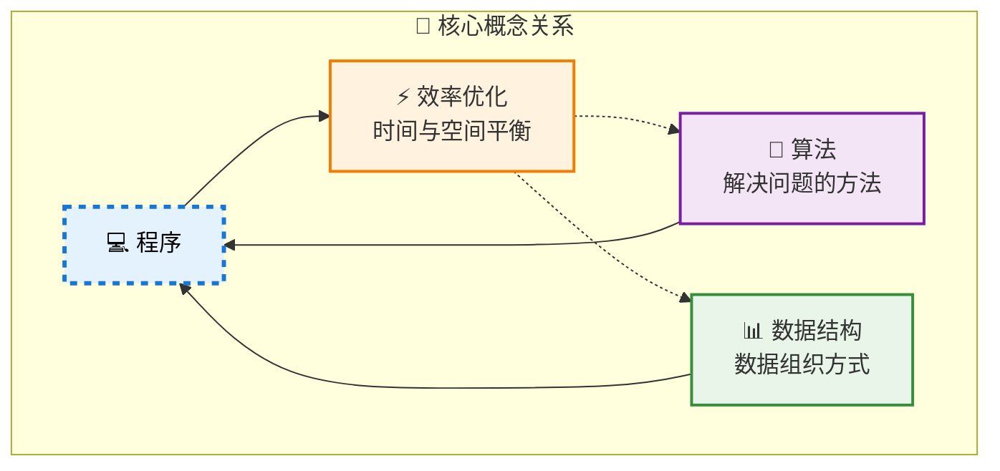

# 三、数据结构

**定义**：具有特定结构特征的数据元素集合，决定数据如何组织、存储和操作。

**核心价值**：就像图书馆的分类系统，好的数据结构能让我们快速找到需要的信息。

## 1. 数据关系的四种结构

### 1.1 集合结构

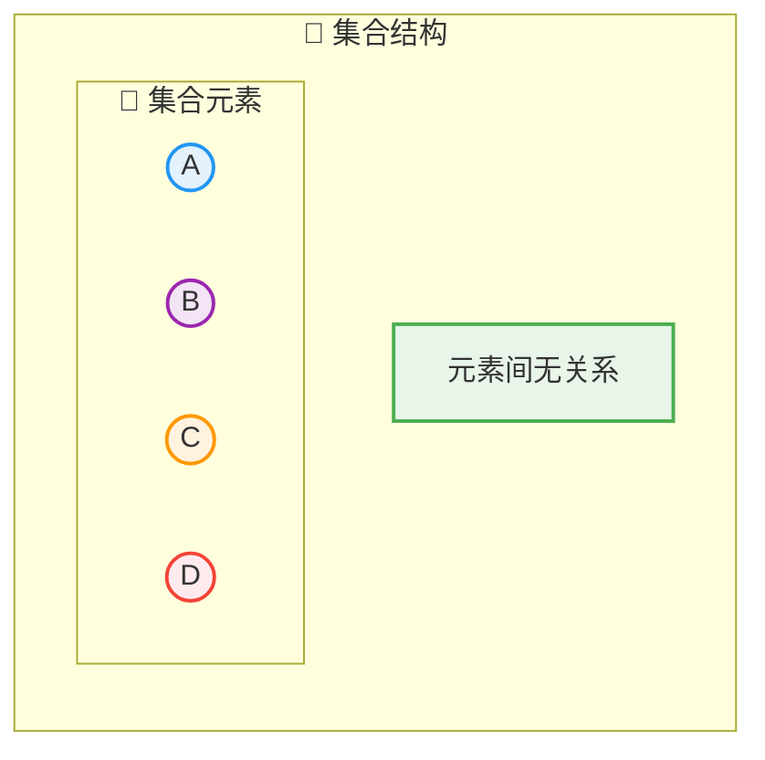

集合结构中数据元素除了属于同一个集合外，他们之间没有任何其他的关系。

### 1.2  线性结构

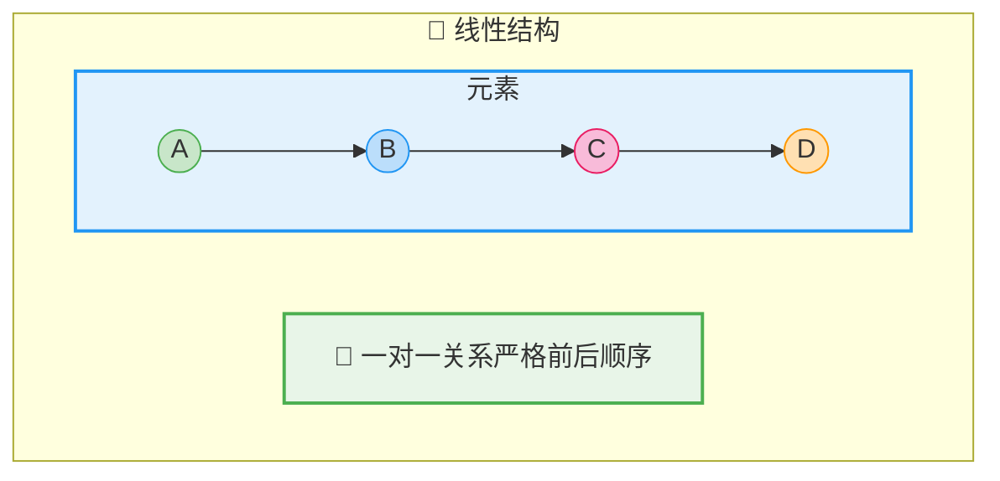

### 1.3  树形结构

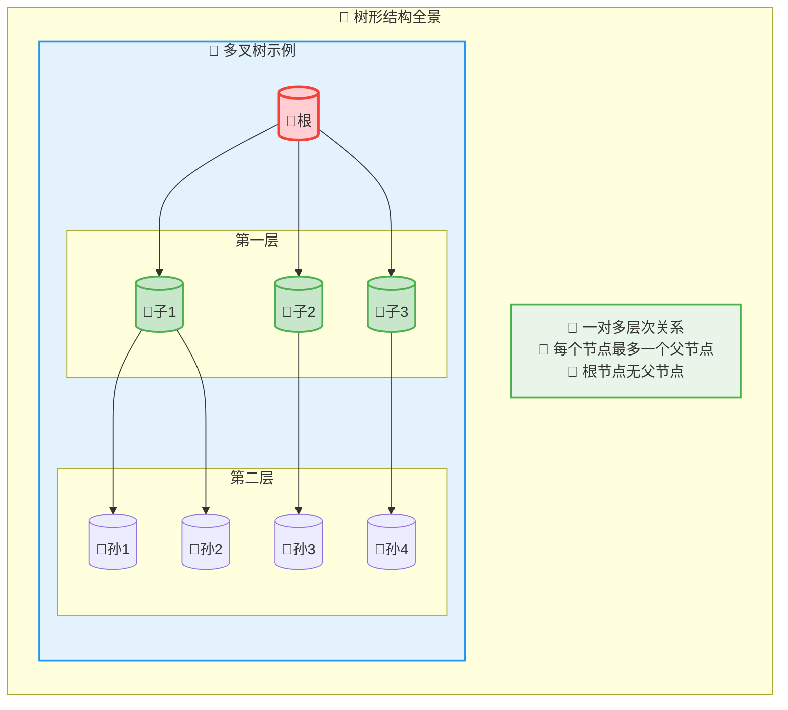

### 1.4  图形结构

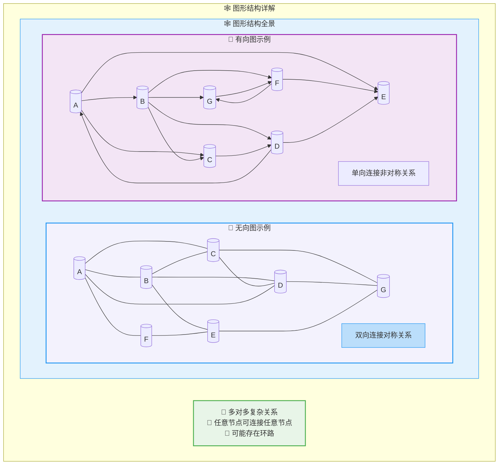

### 2. 数据结构特点对比

| 逻辑结构 | 关系特征 | 典型应用 | 关键特点 |
|---------|---------|---------|----------|
| 🔵 **集合** | 元素无关系 | 去重、集合运算 | 唯一性、无序性 |
| 📏 **线性** | 严格一对一 | 数组、栈、队列、链表 | 顺序访问、前后关系 |
| 🌳 **树形** | 一对多层次 | 文件系统、决策树、DOM | 分层管理、快速查找 |
| 🕸️ **图形** | 多对多网络 | 社交关系、地图导航 | 复杂关系、路径分析 |


## 3. 存储方式的结构

### 3.1 顺序存储
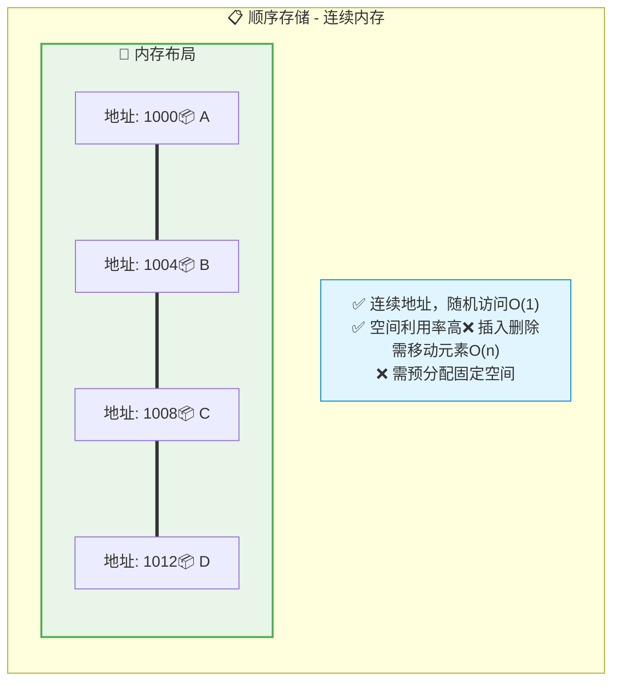

### 3.2 链式存储

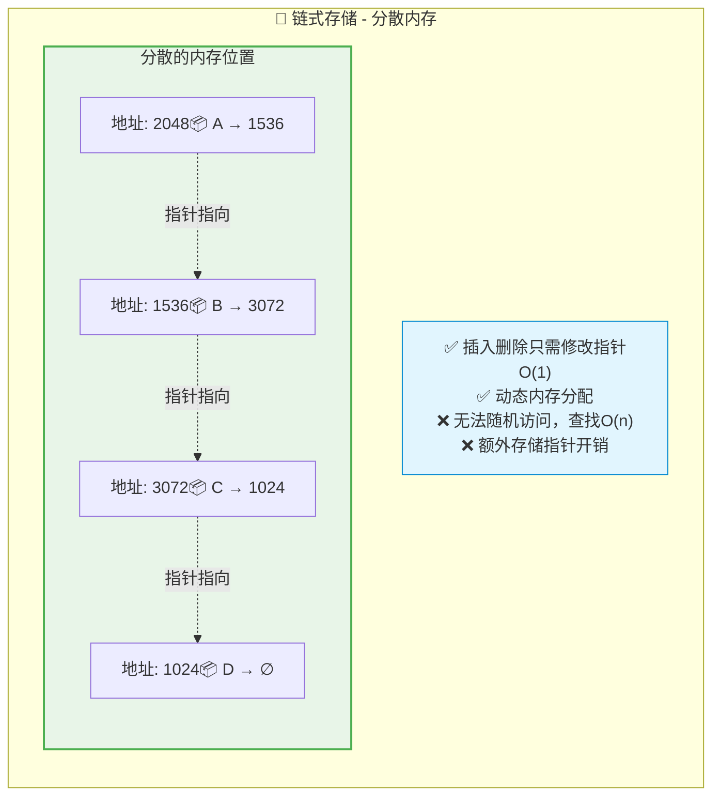

## 2. 算法：解决问题的方法

**定义**：解决特定问题的准确而完整的步骤序列。

**本质**：就像做菜的食谱，好的算法能让我们高效地达成目标。

### 2.1 算法的五大特性

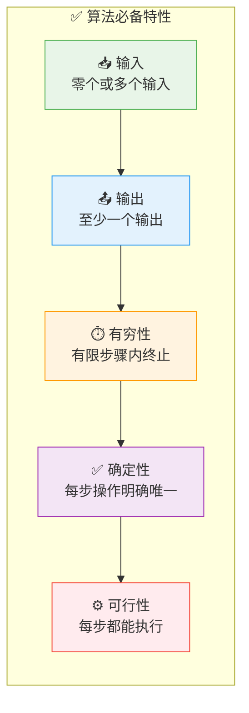

### 2.2 时间复杂度：效率的量化标准

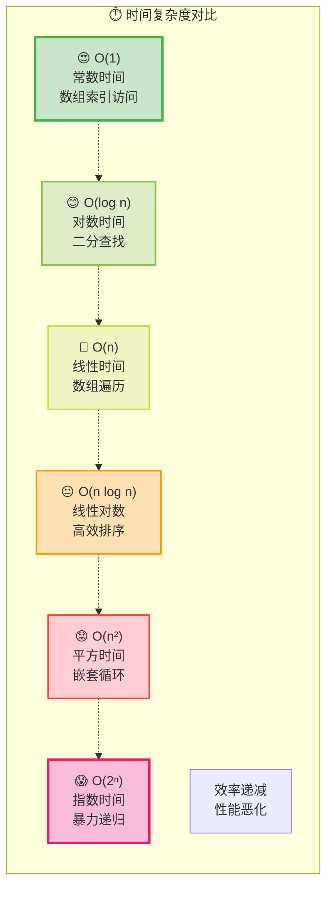

### 2.3 算法优化策略

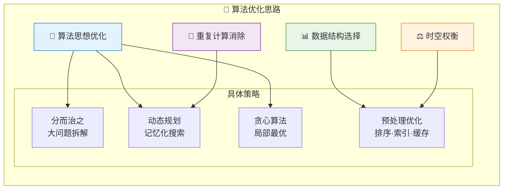

## 3. 实战理解：三个生动例子

### 案例1：出行路径规划 🚗✈️🚄

**问题**：从上海到北京，如何选择最优路线？

| 算法方案 | 时间成本 | 经济成本 | 舒适度 | 适用场景 |
|---------|---------|---------|--------|----------|
| 🛩️ **飞机** | 2小时 | 高 | 高 | 紧急商务 |
| 🚄 **高铁** | 5小时 | 中等 | 高 | 平衡选择 |
| 🚗 **自驾** | 12小时 | 低 | 低 | 预算有限 |

**启发**：不同算法解决同一问题，关键在于优化目标的权重。

### 案例2：计算求和 ➕

**问题**：计算 1+2+3+...+100 = ?

```python
# 算法1：循环累加 - O(n)
def sum_loop():
    result = 0
    for i in range(1, 101):
        result += i
    return result

# 算法2：数学公式 - O(1)
def sum_formula():
    return (1 + 100) * 100 // 2
```

**启发**：巧妙的算法设计能将O(n)降低到O(1)。

### 案例3：查找问题 🔍

**问题**：在有序数组中查找目标值

```python
# 线性查找 - O(n)
def linear_search(arr, target):
    for i, val in enumerate(arr):
        if val == target:
            return i
    return -1

# 二分查找 - O(log n)
def binary_search(arr, target):
    left, right = 0, len(arr) - 1
    while left <= right:
        mid = (left + right) // 2
        if arr[mid] == target:
            return mid
        elif arr[mid] < target:
            left = mid + 1
        else:
            right = mid - 1
    return -1
```

**启发**：利用数据特性（有序性）能大幅提升算法效率。

## 4. 学习路线图

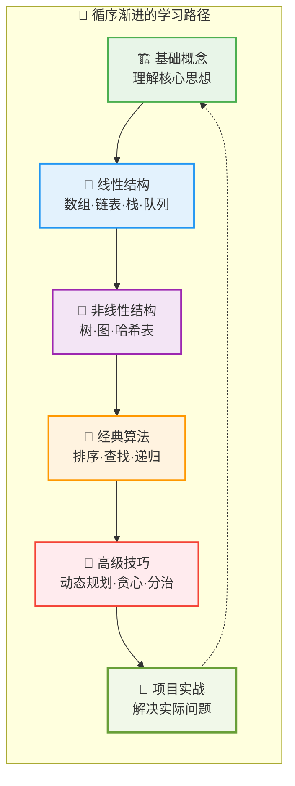

## 5. 学习建议与方法

### 🎯 为什么要学习？

1. **💪 编程能力提升**：写出更高效、更优雅的代码
2. **🧠 思维模式培养**：系统性分析和解决问题
3. **🚀 职业发展加速**：技术面试和项目开发的核心竞争力
4. **🔧 实际问题解决**：为复杂场景选择最适合的解决方案

### 📚 学习方法论

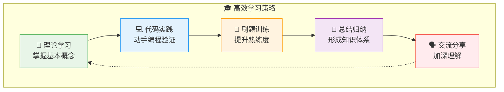

### 🍳 生动类比理解

将算法与数据结构比作烹饪艺术：

- **🥬 数据结构** = 食材的组织方式（切丝、切块、整块）
- **👨‍🍳 算法** = 烹饪的方法和步骤（炒、煮、蒸、炸）
- **🍽️ 程序** = 最终呈现的美味佳肴
- **⭐ 优化** = 追求色香味俱全的极致体验

**关键启发**：同样的食材用不同方法处理，效果天差地别！

## 6. 核心要点总结

### 🎯 知识要点速查

| 概念 | 核心内容 | 关键价值 |
|-----|---------|----------|
| **📐 逻辑结构** | 集合、线性、树形、图形 | 描述数据元素间的逻辑关系 |
| **💾 物理结构** | 顺序存储、链式存储 | 决定内存使用和访问效率 |
| **🧮 算法特性** | 输入、输出、有穷、确定、可行 | 确保算法的正确性和可执行性 |
| **⚡ 复杂度分析** | 时间复杂度、空间复杂度 | 量化算法效率，指导优化方向 |

### 💡 学习心得

算法与数据结构是编程的内功心法。掌握它们能让你：

1. **🎯 精准选择**：为特定问题选择最合适的数据结构
2. **⚡ 高效设计**：设计出时间和空间效率optimal的算法
3. **⚖️ 智慧权衡**：在时间复杂度和空间复杂度间做出明智选择
4. **🔧 持续优化**：写出高质量、可维护、可扩展的代码

### 🌟 成长寄语

> 记住：**优秀的程序员不是天生的，而是通过系统学习和刻意练习成长起来的！**
>
> 就像武侠小说中的内功修炼，算法与数据结构需要日复一日的积累和领悟。
>
> 🚀 开始你的算法之旅吧，每一次练习都让你更接近编程大师！

---

*参考资料*
- 📚 《大话数据结构》——程杰 著
- 📚 《趣学算法》——陈小玉 著
- 📚 《计算机程序设计艺术》——Donald E. Knuth
- 📚 《算法艺术与信息学竞赛》——刘汝佳、黄亮 著
- 🌐 [数据结构与算法 · 看云](https://www.kancloud.cn/zxliu/algorithm/2088786)
