# 算法复杂度

**定义**：衡量算法在输入规模为 `n` 的时候，程序所需要使用的时间和空间。

**理解**：算法复杂度可以理解为运行时需要多少时间和空间资源。

> [!NOTE]
>
> 算法优化的核心是让程序的晕眩时间更短，以及内存占用更小。分析的时候主要从时间和空间入手。

# 一、复杂度分析全景图

<details> 
<summary>展开图表</summary> 

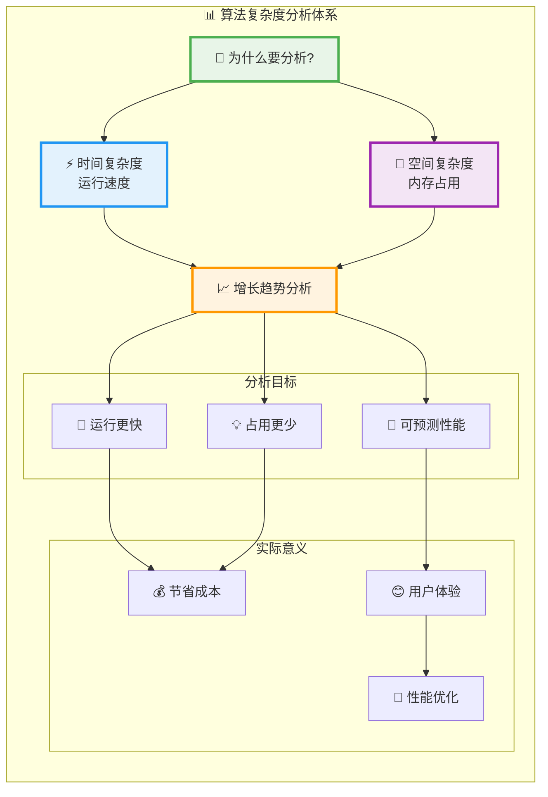
```mermaid
graph LR
    subgraph "📊 算法复杂度分析体系"
        A[🤔 为什么要分析?]
        B[⚡ 时间复杂度<br/>运行速度]
        C[💾 空间复杂度<br/>内存占用]
        D[📈 增长趋势分析]

        subgraph "分析目标"
            A1[🚀 运行更快]
            A2[💡 占用更少]
            A3[📏 可预测性能]
        end

        subgraph "实际意义"
            S1[💰 节省成本]
            S2[😊 用户体验]
            S3[🎯 性能优化]
        end

        A --> B
        A --> C
        B --> D
        C --> D
        D --> A1
        D --> A2
        D --> A3
        A1 --> S1
        A2 --> S1
        A3 --> S2
        S2 --> S3
    end

    style A fill:#e8f5e8,stroke:#4caf50,stroke-width:3px
    style B fill:#e3f2fd,stroke:#2196f3,stroke-width:3px
    style C fill:#f3e5f5,stroke:#9c27b0,stroke-width:3px
    style D fill:#fff3e0,stroke:#ff9800,stroke-width:3px
```

</details>

# 二、算法复杂度

**想象一下**：你在选择交通工具时会考虑什么？时间、费用、舒适度...算法复杂度分析就是帮我们为程序选择最合适的"交通工具"！

## 1. 两种分析方法对比

<details> 
<summary>展开图表</summary> 

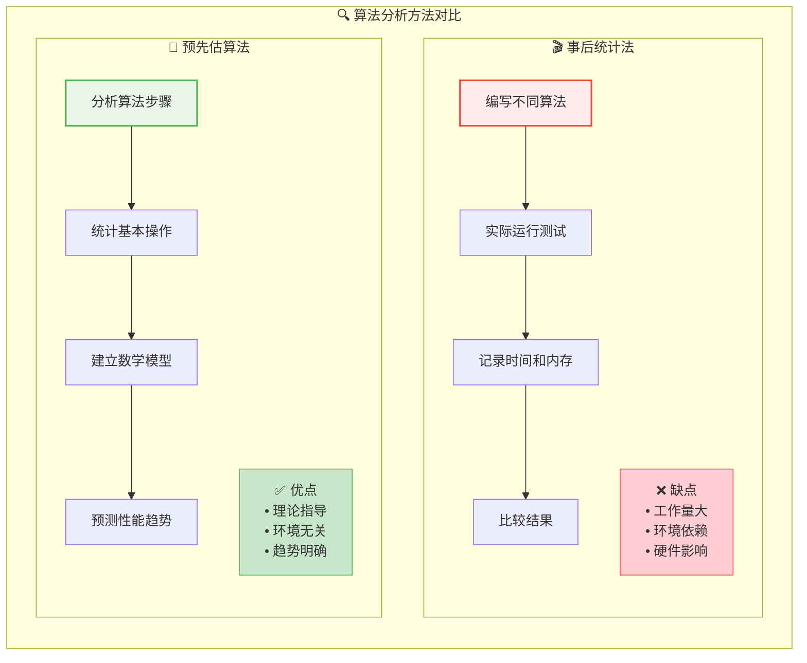
```mermaid
graph LR
    subgraph "🔍 算法分析方法对比"
        subgraph "🎬 事后统计法"
            direction TB
            E1[编写不同算法]
            E2[实际运行测试]
            E3[记录时间和内存]
            E4[比较结果]

            E1 --> E2 --> E3 --> E4

            EP[❌ 缺点<br/>• 工作量大<br/>• 环境依赖<br/>• 硬件影响]
        end

        subgraph "🔮 预先估算法"
            direction TB
            P1[分析算法步骤]
            P2[统计基本操作]
            P3[建立数学模型]
            P4[预测性能趋势]

            P1 --> P2 --> P3 --> P4

            PP[✅ 优点<br/>• 理论指导<br/>• 环境无关<br/>• 趋势明确]
        end
    end

    style E1 fill:#ffebee,stroke:#f44336,stroke-width:2px
    style P1 fill:#e8f5e8,stroke:#4caf50,stroke-width:2px
    style EP fill:#ffcdd2,stroke:#f44336
    style PP fill:#c8e6c9,stroke:#4caf50
```

</details> 


## 2. 问题规模 `n` 的含义

<details> 
<summary>展开图表</summary> 

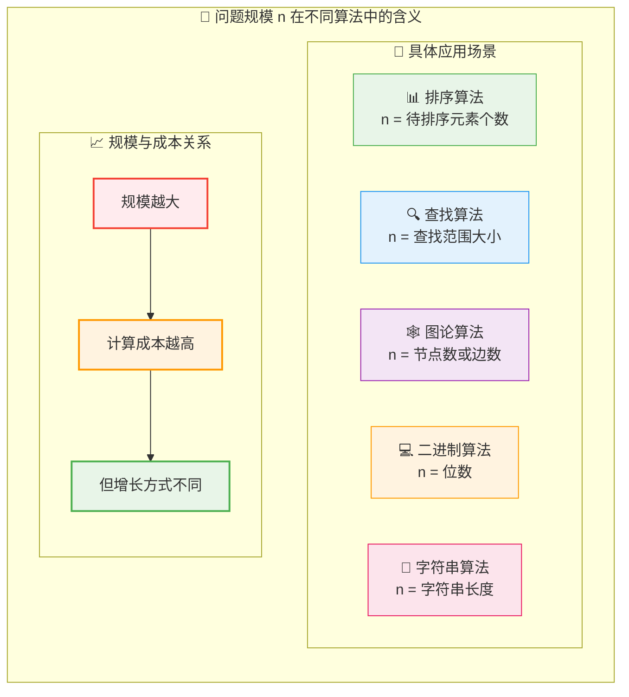
```mermaid
graph LR
    subgraph "🔢 问题规模 n 在不同算法中的含义"
        subgraph "🎯 具体应用场景"
            S1[📊 排序算法<br/>n = 待排序元素个数]
            S2[🔍 查找算法<br/>n = 查找范围大小]
            S3[🕸️ 图论算法<br/>n = 节点数或边数]
            S4[💻 二进制算法<br/>n = 位数]
            S5[🎵 字符串算法<br/>n = 字符串长度]
        end

        subgraph "📈 规模与成本关系"
        direction TB
            R1[规模越大]
            R2[计算成本越高]
            R3[但增长方式不同]

            R1 --> R2 --> R3
        end
    end

    style S1 fill:#e8f5e8,stroke:#4caf50
    style S2 fill:#e3f2fd,stroke:#2196f3
    style S3 fill:#f3e5f5,stroke:#9c27b0
    style S4 fill:#fff3e0,stroke:#ff9800
    style S5 fill:#fce4ec,stroke:#e91e63
    style R1 fill:#ffebee,stroke:#f44336,stroke-width:2px
    style R2 fill:#fff3e0,stroke:#ff9800,stroke-width:2px
    style R3 fill:#e8f5e8,stroke:#4caf50,stroke-width:2px
```

</details> 

# 三、时间复杂度

**本质**：时间复杂度是同级算法中基本操作的次数。即：时间复杂度和算法中的基本操作数量成正比

基本操作是指在常数时间内完成的语句，其执行时间与操作数的大小无关。


## 1. 时间复杂度层次结构

<details> 
<summary>展开图表</summary> 

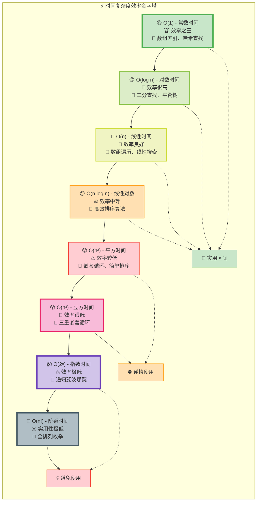
```mermaid
graph TB
    subgraph "⚡ 时间复杂度效率金字塔"
        direction TB

        T1["😍 O(1) - 常数时间<br/>🏆 效率之王<br/>🎯 数组索引、哈希查找"]
        T2["😊 O(log n) - 对数时间<br/>🥈 效率很高<br/>🎯 二分查找、平衡树"]
        T3["🙂 O(n) - 线性时间<br/>🥉 效率良好<br/>🎯 数组遍历、线性搜索"]
        T4["😐 O(n log n) - 线性对数<br/>⚖️ 效率中等<br/>🎯 高效排序算法"]
        T5["😟 O(n²) - 平方时间<br/>⚠️ 效率较低<br/>🎯 嵌套循环、简单排序"]
        T6["😰 O(n³) - 立方时间<br/>🔴 效率很低<br/>🎯 三重嵌套循环"]
        T7["😱 O(2ⁿ) - 指数时间<br/>💥 效率极低<br/>🎯 递归斐波那契"]
        T8["🤯 O(n!) - 阶乘时间<br/>☠️ 实用性极低<br/>🎯 全排列枚举"]

        T1 --> T2 --> T3 --> T4 --> T5 --> T6 --> T7 --> T8

        GOOD[🎉 实用区间]
        BAD[⛔ 谨慎使用]
        TERRIBLE[💀 避免使用]

        T1 -.-> GOOD
        T2 -.-> GOOD
        T3 -.-> GOOD
        T4 -.-> GOOD
        T5 -.-> BAD
        T6 -.-> BAD
        T7 -.-> TERRIBLE
        T8 -.-> TERRIBLE
    end

    style T1 fill:#c8e6c9,stroke:#4caf50,stroke-width:4px
    style T2 fill:#dcedc8,stroke:#8bc34a,stroke-width:3px
    style T3 fill:#f0f4c3,stroke:#cddc39,stroke-width:2px
    style T4 fill:#ffe0b2,stroke:#ff9800,stroke-width:2px
    style T5 fill:#ffcdd2,stroke:#f44336,stroke-width:2px
    style T6 fill:#f8bbd9,stroke:#e91e63,stroke-width:3px
    style T7 fill:#d1c4e9,stroke:#673ab7,stroke-width:4px
    style T8 fill:#b0bec5,stroke:#455a64,stroke-width:4px
    style GOOD fill:#c8e6c9,stroke:#4caf50
    style BAD fill:#ffe0b2,stroke:#ff9800
    style TERRIBLE fill:#ffcdd2,stroke:#f44336
```

</details> 

## 2. 复杂度增长对比

### 2.1 复杂度分类概览

<details> 
<summary>展开图表</summary> 

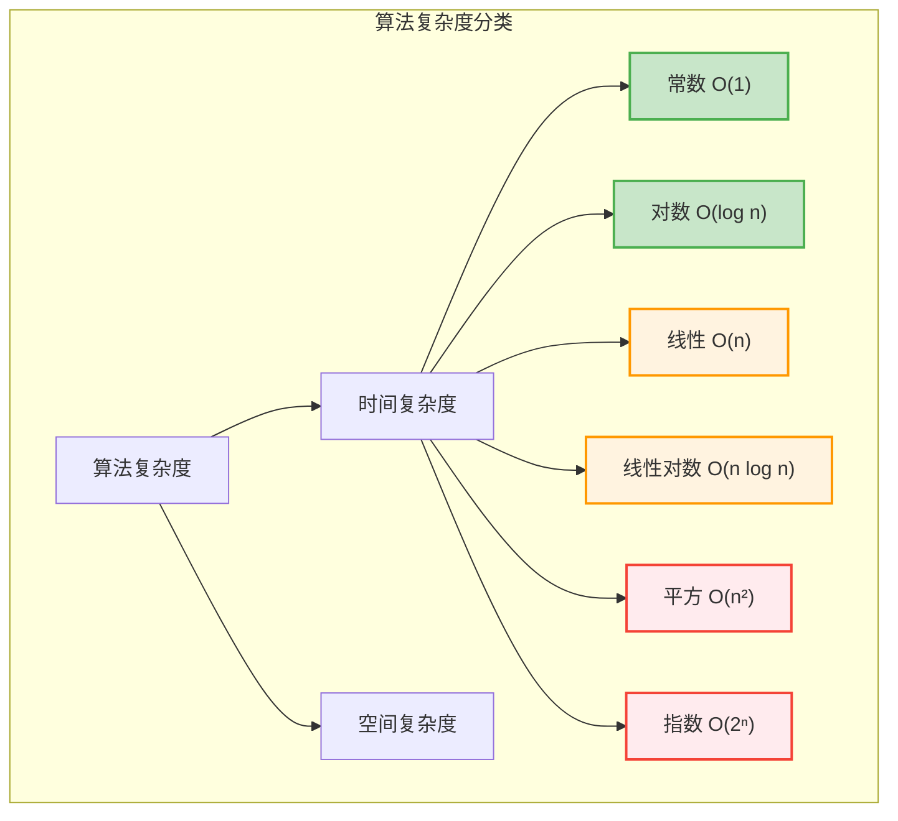
```mermaid
graph TB
    subgraph "算法复杂度分类"
        A[算法复杂度] --> B[时间复杂度]
        A --> C[空间复杂度]

        B --> D["常数 O(1)"]
        B --> E["对数 O(log n)"]
        B --> F["线性 O(n)"]
        B --> G["线性对数 O(n log n)"]
        B --> H["平方 O(n²)"]
        B --> I["指数 O(2ⁿ)"]
    end

    classDef excellent fill:#c8e6c9,stroke:#4caf50,stroke-width:2px
    classDef good fill:#fff3e0,stroke:#ff9800,stroke-width:2px
    classDef poor fill:#ffebee,stroke:#f44336,stroke-width:2px

    class D,E excellent
    class F,G good
    class H,I poor
```

</details> 


常见的时间复杂度类型。绿色表示优秀的复杂度，橙色表示可接受的复杂度，红色表示需要避免的复杂度。

---

### 2.2 性能等级划分

<details> 
<summary>展开图表</summary> 

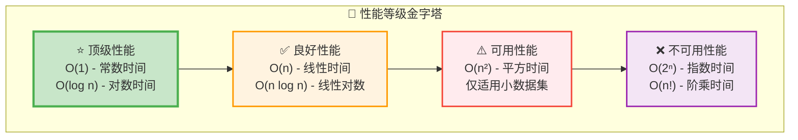
```mermaid
graph TD
    subgraph "🚀 性能等级金字塔"
        A["⭐ 顶级性能<br/>O(1) - 常数时间<br/>O(log n) - 对数时间"]
        B["✅ 良好性能<br/>O(n) - 线性时间<br/>O(n log n) - 线性对数"]
        C["⚠️ 可用性能<br/>O(n²) - 平方时间<br/>仅适用小数据集"]
        D["❌ 不可用性能<br/>O(2ⁿ) - 指数时间<br/>O(n!) - 阶乘时间"]

        A --> B --> C --> D
    end

    classDef excellent fill:#c8e6c9,stroke:#4caf50,stroke-width:3px
    classDef good fill:#fff3e0,stroke:#ff9800,stroke-width:2px
    classDef caution fill:#ffebee,stroke:#f44336,stroke-width:2px
    classDef avoid fill:#f3e5f5,stroke:#9c27b0,stroke-width:2px

    class A excellent
    class B good
    class C caution
    class D avoid
```

</details> 

金字塔结构清晰展示了不同复杂度的性能等级。越往上性能越好，实际应用中应该优先选择上层的复杂度。

---

### 2.3 具体数值对比

<details> 
<summary>展开图表</summary> 

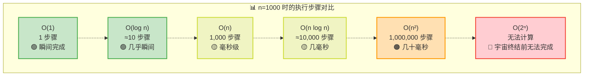
```mermaid
graph TB
    subgraph "📊 n=1000 时的执行步骤对比"
        O1["O(1)<br/>1 步骤<br/>🟢 瞬间完成"]
        OLOG["O(log n)<br/>≈10 步骤<br/>🟢 几乎瞬间"]
        ON["O(n)<br/>1,000 步骤<br/>🟡 毫秒级"]
        ONLOG["O(n log n)<br/>≈10,000 步骤<br/>🟡 几毫秒"]
        ON2["O(n²)<br/>1,000,000 步骤<br/>🟠 几十毫秒"]
        O2N["O(2ⁿ)<br/>无法计算<br/>🔴 宇宙终结前无法完成"]

        O1 -.-> OLOG -.-> ON -.-> ONLOG -.-> ON2 -.-> O2N
    end

    classDef instant fill:#c8e6c9,stroke:#4caf50,stroke-width:2px
    classDef fast fill:#f0f4c3,stroke:#cddc39,stroke-width:2px
    classDef acceptable fill:#ffe0b2,stroke:#ff9800,stroke-width:2px
    classDef impossible fill:#ffcdd2,stroke:#f44336,stroke-width:2px

    class O1,OLOG instant
    class ON,ONLOG fast
    class ON2 acceptable
    class O2N impossible
```

</details> 

这个对比图以 n=1000 为例，直观展示了不同复杂度的实际执行步骤数。

可以看出指数复杂度与其他复杂度之间的巨大差距。

---

## 3. 增长趋势可视化

<details> 
<summary>展开图表</summary> 

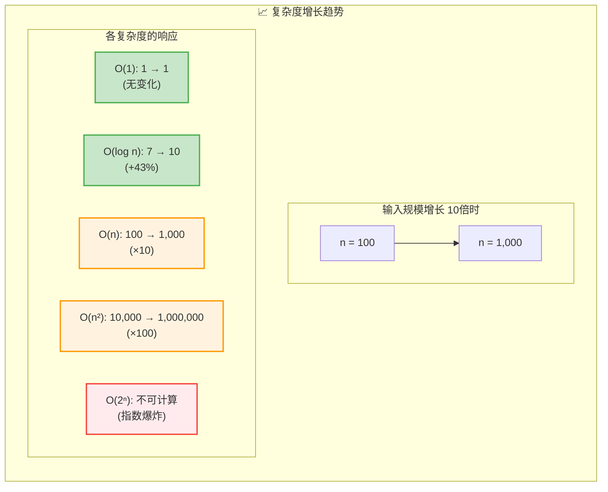
```mermaid
graph LR
    subgraph "📈 复杂度增长趋势"
        subgraph "输入规模增长 10倍时"
            A1["n = 100"] --> A2["n = 1,000"]
        end

        subgraph "各复杂度的响应"
            B1["O(1): 1 → 1<br/>(无变化)"]
            B2["O(log n): 7 → 10<br/>(+43%)"]
            B3["O(n): 100 → 1,000<br/>(×10)"]
            B4["O(n²): 10,000 → 1,000,000<br/>(×100)"]
            B5["O(2ⁿ): 不可计算<br/>(指数爆炸)"]
        end
    end

    classDef stable fill:#c8e6c9,stroke:#4caf50,stroke-width:2px
    classDef linear fill:#fff3e0,stroke:#ff9800,stroke-width:2px
    classDef explosive fill:#ffebee,stroke:#f44336,stroke-width:2px

    class B1,B2 stable
    class B3,B4 linear
    class B5 explosive
```
</details> 

**说明**：当输入规模增长10倍时，不同复杂度的性能衰减程度大不相同。常数和对数复杂度几乎不受影响，而平方和指数复杂度则急剧恶化。

---

## 4. 实际应用场景

<details> 
<summary>展开图表</summary> 

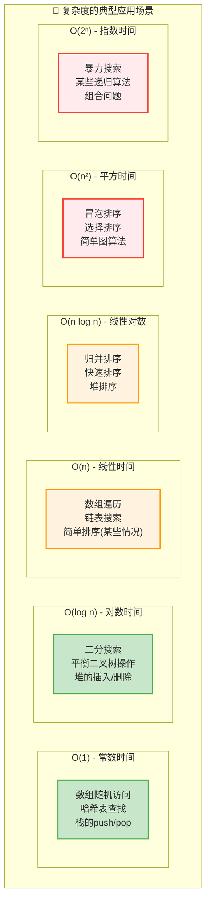
```mermaid
graph TD
    subgraph "🔧 复杂度的典型应用场景"
        subgraph "O(1) - 常数时间"
            A1["数组随机访问<br/>哈希表查找<br/>栈的push/pop"]
        end

        subgraph "O(log n) - 对数时间"
            A2["二分搜索<br/>平衡二叉树操作<br/>堆的插入/删除"]
        end

        subgraph "O(n) - 线性时间"
            A3["数组遍历<br/>链表搜索<br/>简单排序(某些情况)"]
        end

        subgraph "O(n log n) - 线性对数"
            A4["归并排序<br/>快速排序<br/>堆排序"]
        end

        subgraph "O(n²) - 平方时间"
            A5["冒泡排序<br/>选择排序<br/>简单图算法"]
        end

        subgraph "O(2ⁿ) - 指数时间"
            A6["暴力搜索<br/>某些递归算法<br/>组合问题"]
        end
    end

    classDef excellent fill:#c8e6c9,stroke:#4caf50,stroke-width:2px
    classDef good fill:#fff3e0,stroke:#ff9800,stroke-width:2px
    classDef caution fill:#ffebee,stroke:#f44336,stroke-width:2px

    class A1,A2 excellent
    class A3,A4 good
    class A5,A6 caution
```

</details> 


**说明**：这个图表展示了不同复杂度在实际编程中的典型应用场景，帮助理解何时会遇到各种复杂度。

---

## 5. 总结要点

###  核心原则
- **小数据集**：简单实现比复杂优化更重要
- **大数据集**：必须优先考虑时间复杂度
- **频繁操作**：即使中等规模也要选择高效算法

### 性能对比关键数据

| 复杂度       | n=10  | n=100         | n=1,000   | n=10,000    |
| ------------ | ----- | ------------- | --------- | ----------- |
| O(1)         | 1     | 1             | 1         | 1           |
| O(log n)     | 3     | 7             | 10        | 13          |
| O(n)         | 10    | 100           | 1,000     | 10,000      |
| $O(n log_n)$ | 33    | 664           | 9,966     | 132,877     |
| O(n²)        | 100   | 10,000        | 1,000,000 | 100,000,000 |
| O(2ⁿ)        | 1,024 | $1.3×10^{30}$ | 不可计算  | 不可计算    |

### 重要提醒

- $O(2^n)$ 复杂度在 `n>30` 时基本不可用
- $O(n^2)$ 算法适用于 `n<1000` 的场景
- 选择算法时要考虑平均情况，不只是最坏情况

# 四、空间复杂度

### 3.1 空间复杂度层次结构

<details> 
<summary>展开图表</summary> 

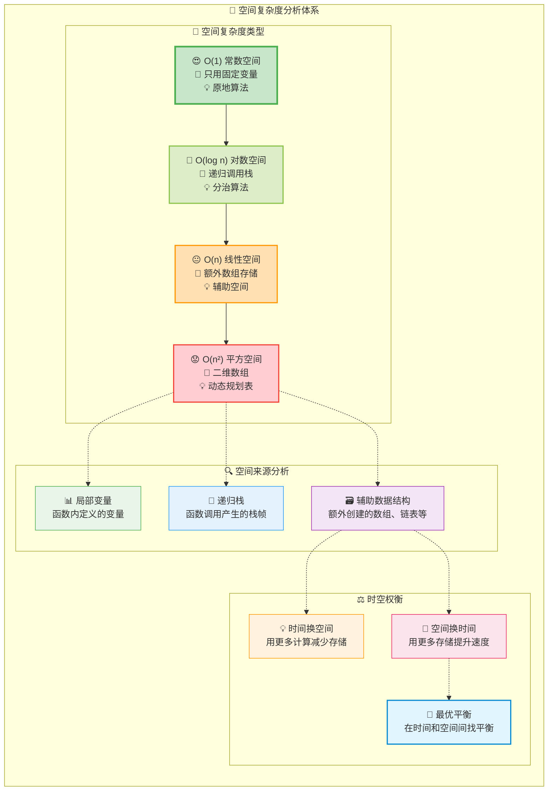
```mermaid
graph LR
    subgraph "💾 空间复杂度分析体系"
        subgraph "🧮 空间复杂度类型"
            S1["😍 O(1) 常数空间<br/>🎯 只用固定变量<br/>💡 原地算法"]

            S2["🙂 O(log n) 对数空间<br/>🎯 递归调用栈<br/>💡 分治算法"]

            S3["😐 O(n) 线性空间<br/>🎯 额外数组存储<br/>💡 辅助空间"]

            S4["😟 O(n²) 平方空间<br/>🎯 二维数组<br/>💡 动态规划表"]

            S1 --> S2 --> S3 --> S4
        end

        subgraph "🔍 空间来源分析"
            SO1["📊 局部变量<br/>函数内定义的变量"]
            SO2["🔄 递归栈<br/>函数调用产生的栈帧"]
            SO3["🗃️ 辅助数据结构<br/>额外创建的数组、链表等"]
        end

        subgraph "⚖️ 时空权衡"
            TR1["💡 时间换空间<br/>用更多计算减少存储"]
            TR2["💾 空间换时间<br/>用更多存储提升速度"]
            TR3["🎯 最优平衡<br/>在时间和空间间找平衡"]
        end

        S4 -.-> SO1
        S4 -.-> SO2
        S4 -.-> SO3
        SO3 -.-> TR1
        SO3 -.-> TR2
        TR2 -.-> TR3
    end

    style S1 fill:#c8e6c9,stroke:#4caf50,stroke-width:3px
    style S2 fill:#dcedc8,stroke:#8bc34a,stroke-width:2px
    style S3 fill:#ffe0b2,stroke:#ff9800,stroke-width:2px
    style S4 fill:#ffcdd2,stroke:#f44336,stroke-width:2px
    style SO1 fill:#e8f5e8,stroke:#4caf50
    style SO2 fill:#e3f2fd,stroke:#2196f3
    style SO3 fill:#f3e5f5,stroke:#9c27b0
    style TR1 fill:#fff3e0,stroke:#ff9800
    style TR2 fill:#fce4ec,stroke:#e91e63
    style TR3 fill:#e1f5fe,stroke:#0288d1,stroke-width:2px
```

</details> 


### 3.2 空间复杂度实例分析

#### 3.2.1 `O(1)` 空间

```python
def find_max(arr):
  max_val = arr[0]  # 1个变量
  for num in arr:
    if num > max_val:
      max_val = num
      return max_val
```


**分析**: 只用了一个 `max_val`变量

**空间复杂度**: $O(1)$


#### 3.2.2 `O(n)` 空间

```py
def reverse_array(arr):
  result = []  # 新数组，n个元素
  for i in range(len(arr)-1, -1, -1):
    result.append(arr[i])
    return result
```

**分析**: 创建了大小为n的新数组

**空间复杂度**: $O(n)$


#### 3.2.3 `O(n)` 递归空间

```py
def factorial(n):
  if n <= 1:
    return 1
  return n * factorial(n-1)
```

**分析**: 递归深度为 `n` 层，每层都占用栈空间

**空间复杂度**: $O(n)$


## 4. 复杂度分析实战指南

### 4.1 分析流程图

<details> 
<summary>展开图表</summary> 

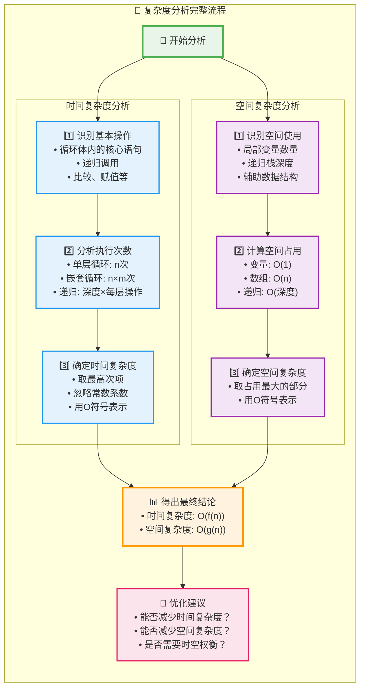
```mermaid
graph LR
    subgraph "🎯 复杂度分析完整流程"
        START["🚀 开始分析"]

        subgraph "时间复杂度分析"
            T_STEP1["1️⃣ 识别基本操作<br/>• 循环体内的核心语句<br/>• 递归调用<br/>• 比较、赋值等"]

            T_STEP2["2️⃣ 分析执行次数<br/>• 单层循环: n次<br/>• 嵌套循环: n×m次<br/>• 递归: 深度×每层操作"]

            T_STEP3["3️⃣ 确定时间复杂度<br/>• 取最高次项<br/>• 忽略常数系数<br/>• 用O符号表示"]
        end

        subgraph "空间复杂度分析"
            S_STEP1["1️⃣ 识别空间使用<br/>• 局部变量数量<br/>• 递归栈深度<br/>• 辅助数据结构"]

            S_STEP2["2️⃣ 计算空间占用<br/>• 变量: O(1)<br/>• 数组: O(n)<br/>• 递归: O(深度)"]

            S_STEP3["3️⃣ 确定空间复杂度<br/>• 取占用最大的部分<br/>• 用O符号表示"]
        end

        RESULT["📊 得出最终结论<br/>• 时间复杂度: O(f(n))<br/>• 空间复杂度: O(g(n))"]

        OPTIMIZE["🔧 优化建议<br/>• 能否减少时间复杂度？<br/>• 能否减少空间复杂度？<br/>• 是否需要时空权衡？"]

        START --> T_STEP1
        START --> S_STEP1
        T_STEP1 --> T_STEP2 --> T_STEP3
        S_STEP1 --> S_STEP2 --> S_STEP3
        T_STEP3 --> RESULT
        S_STEP3 --> RESULT
        RESULT --> OPTIMIZE
    end

    style START fill:#e8f5e8,stroke:#4caf50,stroke-width:3px
    style T_STEP1 fill:#e3f2fd,stroke:#2196f3,stroke-width:2px
    style T_STEP2 fill:#e3f2fd,stroke:#2196f3,stroke-width:2px
    style T_STEP3 fill:#e3f2fd,stroke:#2196f3,stroke-width:2px
    style S_STEP1 fill:#f3e5f5,stroke:#9c27b0,stroke-width:2px
    style S_STEP2 fill:#f3e5f5,stroke:#9c27b0,stroke-width:2px
    style S_STEP3 fill:#f3e5f5,stroke:#9c27b0,stroke-width:2px
    style RESULT fill:#fff3e0,stroke:#ff9800,stroke-width:3px
    style OPTIMIZE fill:#fce4ec,stroke:#e91e63,stroke-width:2px
```

</details> 


### 4.2 常见陷阱与误区

<details> 
<summary>展开图表</summary> 

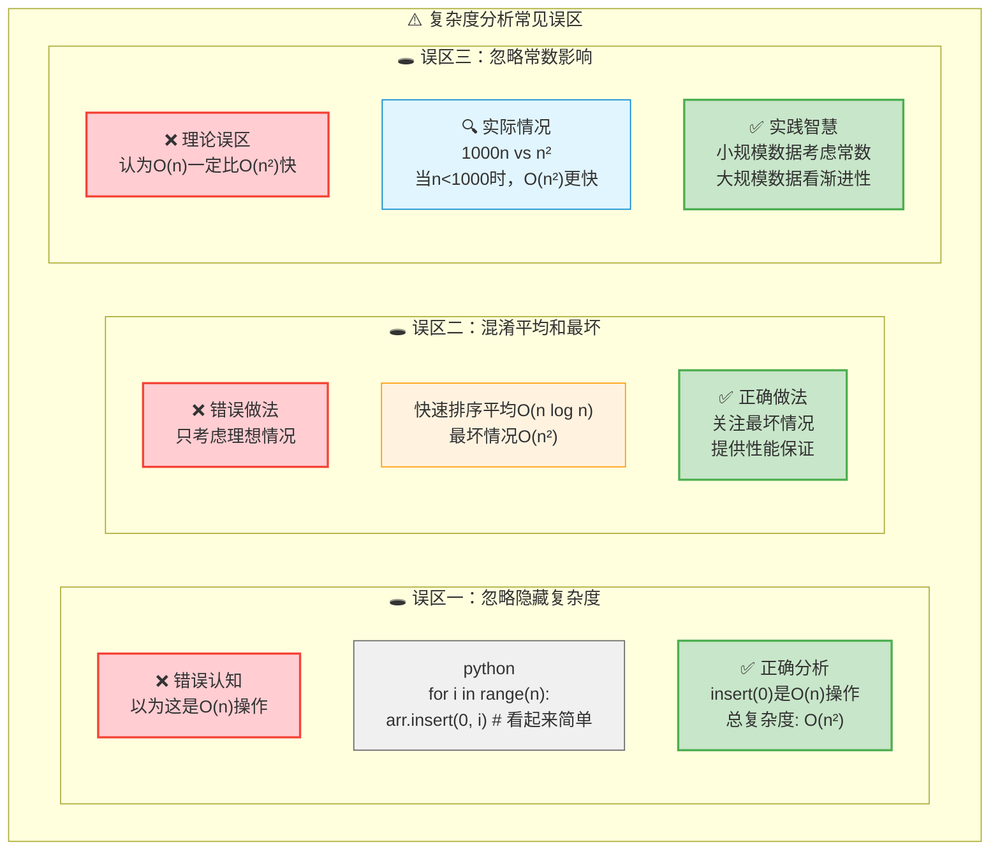
```mermaid
graph TB
    subgraph "⚠️ 复杂度分析常见误区"
        subgraph "🕳️ 误区一：忽略隐藏复杂度"
            M1["❌ 错误认知<br/>以为这是O(n)操作"]
            M1_CODE["python<br/>for i in range(n):<br/>    arr.insert(0, i)  # 看起来简单<br/>"]
            M1_FIX["✅ 正确分析<br/>insert(0)是O(n)操作<br/>总复杂度: O(n²)"]
        end

        subgraph "🕳️ 误区二：混淆平均和最坏"
            M2["❌ 错误做法<br/>只考虑理想情况"]
            M2_EXAMPLE["快速排序平均O(n log n)<br/>最坏情况O(n²)"]
            M2_FIX["✅ 正确做法<br/>关注最坏情况<br/>提供性能保证"]
        end

        subgraph "🕳️ 误区三：忽略常数影响"
            M3["❌ 理论误区<br/>认为O(n)一定比O(n²)快"]
            M3_REAL["🔍 实际情况<br/>1000n vs n²<br/>当n<1000时，O(n²)更快"]
            M3_FIX["✅ 实践智慧<br/>小规模数据考虑常数<br/>大规模数据看渐进性"]
        end
    end

    style M1 fill:#ffcdd2,stroke:#f44336,stroke-width:2px
    style M1_FIX fill:#c8e6c9,stroke:#4caf50,stroke-width:2px
    style M2 fill:#ffcdd2,stroke:#f44336,stroke-width:2px
    style M2_FIX fill:#c8e6c9,stroke:#4caf50,stroke-width:2px
    style M3 fill:#ffcdd2,stroke:#f44336,stroke-width:2px
    style M3_FIX fill:#c8e6c9,stroke:#4caf50,stroke-width:2px
    style M1_CODE fill:#f0f0f0,stroke:#666
    style M2_EXAMPLE fill:#fff3e0,stroke:#ff9800
    style M3_REAL fill:#e1f5fe,stroke:#0288d1
```
</details> 


## 5. 复杂度优化策略

<details> 
<summary>展开图表</summary> 

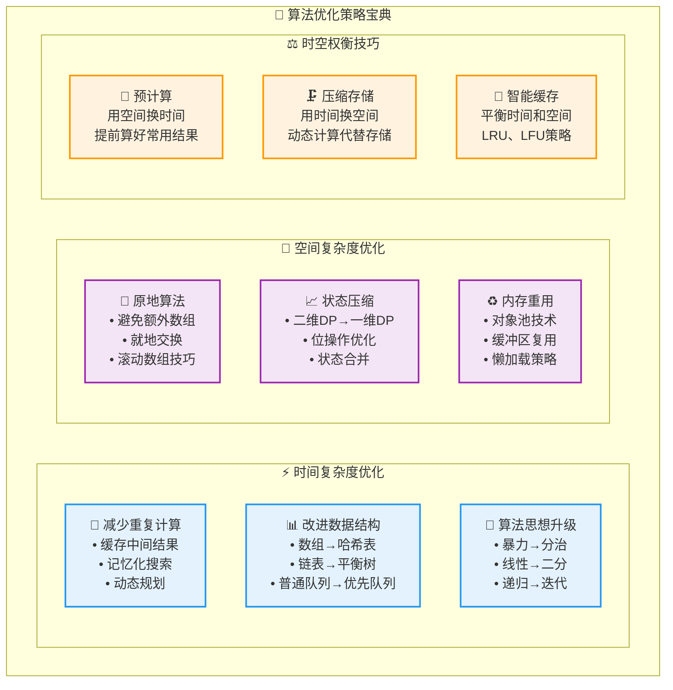
```mermaid
graph TB
    subgraph "🚀 算法优化策略宝典"
        subgraph "⚡ 时间复杂度优化"
            T1["🔄 减少重复计算<br/>• 缓存中间结果<br/>• 记忆化搜索<br/>• 动态规划"]

            T2["📊 改进数据结构<br/>• 数组→哈希表<br/>• 链表→平衡树<br/>• 普通队列→优先队列"]

            T3["🎯 算法思想升级<br/>• 暴力→分治<br/>• 线性→二分<br/>• 递归→迭代"]
        end

        subgraph "💾 空间复杂度优化"
            S1["🔄 原地算法<br/>• 避免额外数组<br/>• 就地交换<br/>• 滚动数组技巧"]

            S2["📈 状态压缩<br/>• 二维DP→一维DP<br/>• 位操作优化<br/>• 状态合并"]

            S3["♻️ 内存重用<br/>• 对象池技术<br/>• 缓冲区复用<br/>• 懒加载策略"]
        end

        subgraph "⚖️ 时空权衡技巧"
            TS1["🎨 预计算<br/>用空间换时间<br/>提前算好常用结果"]

            TS2["🗜️ 压缩存储<br/>用时间换空间<br/>动态计算代替存储"]

            TS3["🎯 智能缓存<br/>平衡时间和空间<br/>LRU、LFU策略"]
        end
    end

    style T1 fill:#e3f2fd,stroke:#2196f3,stroke-width:2px
    style T2 fill:#e3f2fd,stroke:#2196f3,stroke-width:2px
    style T3 fill:#e3f2fd,stroke:#2196f3,stroke-width:2px
    style S1 fill:#f3e5f5,stroke:#9c27b0,stroke-width:2px
    style S2 fill:#f3e5f5,stroke:#9c27b0,stroke-width:2px
    style S3 fill:#f3e5f5,stroke:#9c27b0,stroke-width:2px
    style TS1 fill:#fff3e0,stroke:#ff9800,stroke-width:2px
    style TS2 fill:#fff3e0,stroke:#ff9800,stroke-width:2px
    style TS3 fill:#fff3e0,stroke:#ff9800,stroke-width:2px
```

</details> 


## 6. 实际应用场景

### 6.1 不同场景的复杂度要求

<details> 
<summary>展开图表</summary> 

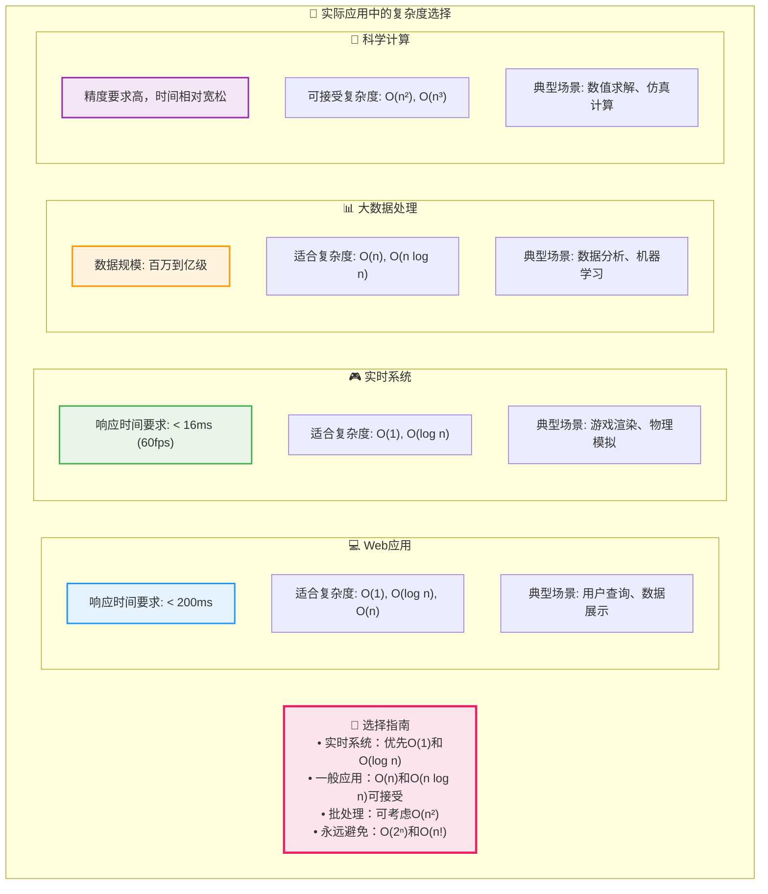
```mermaid
graph TB
    subgraph "🎯 实际应用中的复杂度选择"
        subgraph "💻 Web应用"
            W1["响应时间要求: < 200ms"]
            W2["适合复杂度: O(1), O(log n), O(n)"]
            W3["典型场景: 用户查询、数据展示"]
        end

        subgraph "🎮 实时系统"
            G1["响应时间要求: < 16ms (60fps)"]
            G2["适合复杂度: O(1), O(log n)"]
            G3["典型场景: 游戏渲染、物理模拟"]
        end

        subgraph "📊 大数据处理"
            B1["数据规模: 百万到亿级"]
            B2["适合复杂度: O(n), O(n log n)"]
            B3["典型场景: 数据分析、机器学习"]
        end

        subgraph "🔬 科学计算"
            S1["精度要求高，时间相对宽松"]
            S2["可接受复杂度: O(n²), O(n³)"]
            S3["典型场景: 数值求解、仿真计算"]
        end

        GUIDELINE["🎯 选择指南<br/>• 实时系统：优先O(1)和O(log n)<br/>• 一般应用：O(n)和O(n log n)可接受<br/>• 批处理：可考虑O(n²)<br/>• 永远避免：O(2ⁿ)和O(n!)"]
    end

    style W1 fill:#e3f2fd,stroke:#2196f3,stroke-width:2px
    style G1 fill:#e8f5e8,stroke:#4caf50,stroke-width:2px
    style B1 fill:#fff3e0,stroke:#ff9800,stroke-width:2px
    style S1 fill:#f3e5f5,stroke:#9c27b0,stroke-width:2px
    style GUIDELINE fill:#fce4ec,stroke:#e91e63,stroke-width:3px
```

</details> 

# 四、 渐进符号

三大渐进符号：`大O`

<details> 
<summary>展开图表</summary> 

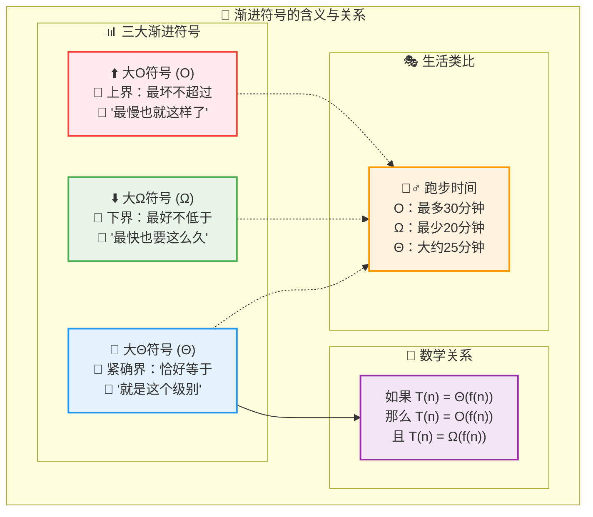
```mermaid
graph TB
    subgraph "🔣 渐进符号的含义与关系"
        subgraph "📊 三大渐进符号"
            O1["⬆️ 大O符号 (O)<br/>🎯 上界：最坏不超过<br/>💭 '最慢也就这样了'"]
            O2["⬇️ 大Ω符号 (Ω)<br/>🎯 下界：最好不低于<br/>💭 '最快也要这么久'"]
            O3["🎯 大Θ符号 (Θ)<br/>🎯 紧确界：恰好等于<br/>💭 '就是这个级别'"]
        end

        subgraph "🎭 生活类比"
            L1["🏃‍♂️ 跑步时间<br/>O：最多30分钟<br/>Ω：最少20分钟<br/>Θ：大约25分钟"]
        end

        subgraph "📐 数学关系"
            M1["如果 T(n) = Θ(f(n))<br/>那么 T(n) = O(f(n))<br/>且 T(n) = Ω(f(n))"]
        end

        O1 -.-> L1
        O2 -.-> L1
        O3 -.-> L1
        O3 --> M1
    end

    style O1 fill:#ffebee,stroke:#f44336,stroke-width:2px
    style O2 fill:#e8f5e8,stroke:#4caf50,stroke-width:2px
    style O3 fill:#e3f2fd,stroke:#2196f3,stroke-width:2px
    style L1 fill:#fff3e0,stroke:#ff9800,stroke-width:2px
    style M1 fill:#f3e5f5,stroke:#9c27b0,stroke-width:2px
```

</details> 

### 2.4 复杂度计算实战

<details> 
<summary>展开图表</summary> 

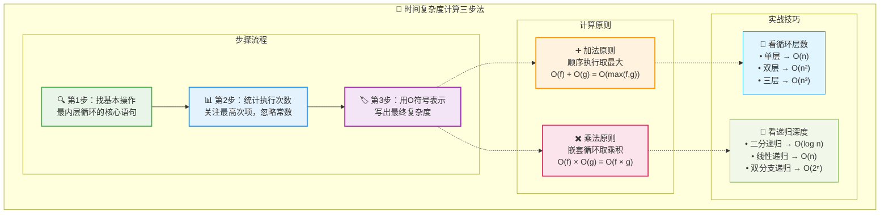
```mermaid
graph TB
    subgraph "🧮 时间复杂度计算三步法"
        subgraph "步骤流程"
            S1["🔍 第1步：找基本操作<br/>最内层循环的核心语句"]
            S2["📊 第2步：统计执行次数<br/>关注最高次项，忽略常数"]
            S3["🏷️ 第3步：用O符号表示<br/>写出最终复杂度"]

            S1 --> S2 --> S3
        end

        subgraph "计算原则"
            P1["➕ 加法原则<br/>顺序执行取最大<br/>O(f) + O(g) = O(max(f,g))"]
            P2["✖️ 乘法原则<br/>嵌套循环取乘积<br/>O(f) × O(g) = O(f × g)"]
        end

        subgraph "实战技巧"
            T1["🎯 看循环层数<br/>• 单层 → O(n)<br/>• 双层 → O(n²)<br/>• 三层 → O(n³)"]

            T2["🔄 看递归深度<br/>• 二分递归 → O(log n)<br/>• 线性递归 → O(n)<br/>• 双分支递归 → O(2ⁿ)"]
        end

        S3 -.-> P1
        S3 -.-> P2
        P1 -.-> T1
        P2 -.-> T2
    end

    style S1 fill:#e8f5e8,stroke:#4caf50,stroke-width:2px
    style S2 fill:#e3f2fd,stroke:#2196f3,stroke-width:2px
    style S3 fill:#f3e5f5,stroke:#9c27b0,stroke-width:2px
    style P1 fill:#fff3e0,stroke:#ff9800,stroke-width:2px
    style P2 fill:#fce4ec,stroke:#e91e63,stroke-width:2px
    style T1 fill:#e1f5fe,stroke:#0288d1
    style T2 fill:#f1f8e9,stroke:#689f38
```

</details> 

### 2.5 典型算法复杂度图谱

<details> 
<summary>展开图表</summary> 

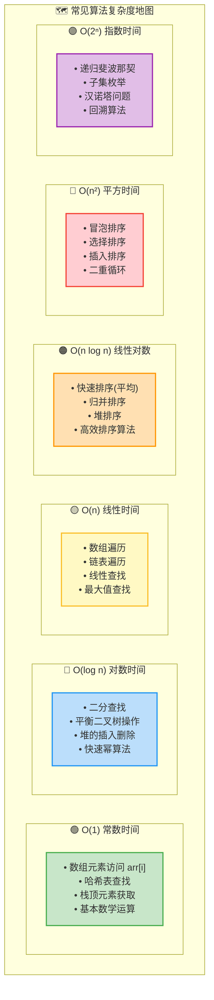
```mermaid
graph TB
    subgraph "🗺️ 常见算法复杂度地图"
        subgraph "🟢 O(1) 常数时间"
            C1["• 数组元素访问 arr[i]<br/>• 哈希表查找<br/>• 栈顶元素获取<br/>• 基本数学运算"]
        end

        subgraph "🔵 O(log n) 对数时间"
            L1["• 二分查找<br/>• 平衡二叉树操作<br/>• 堆的插入删除<br/>• 快速幂算法"]
        end

        subgraph "🟡 O(n) 线性时间"
            N1["• 数组遍历<br/>• 链表遍历<br/>• 线性查找<br/>• 最大值查找"]
        end

        subgraph "🟠 O(n log n) 线性对数"
            NL1["• 快速排序(平均)<br/>• 归并排序<br/>• 堆排序<br/>• 高效排序算法"]
        end

        subgraph "🔴 O(n²) 平方时间"
            N2["• 冒泡排序<br/>• 选择排序<br/>• 插入排序<br/>• 二重循环"]
        end

        subgraph "🟣 O(2ⁿ) 指数时间"
            EX1["• 递归斐波那契<br/>• 子集枚举<br/>• 汉诺塔问题<br/>• 回溯算法"]
        end
    end

    style C1 fill:#c8e6c9,stroke:#4caf50,stroke-width:2px
    style L1 fill:#bbdefb,stroke:#2196f3,stroke-width:2px
    style N1 fill:#fff9c4,stroke:#fbc02d,stroke-width:2px
    style NL1 fill:#ffe0b2,stroke:#ff9800,stroke-width:2px
    style N2 fill:#ffcdd2,stroke:#f44336,stroke-width:2px
    style EX1 fill:#e1bee7,stroke:#9c27b0,stroke-width:2px
```

</details> 

### 2.6 最佳/最坏/平均情况分析

<details> 
<summary>展开图表</summary> 

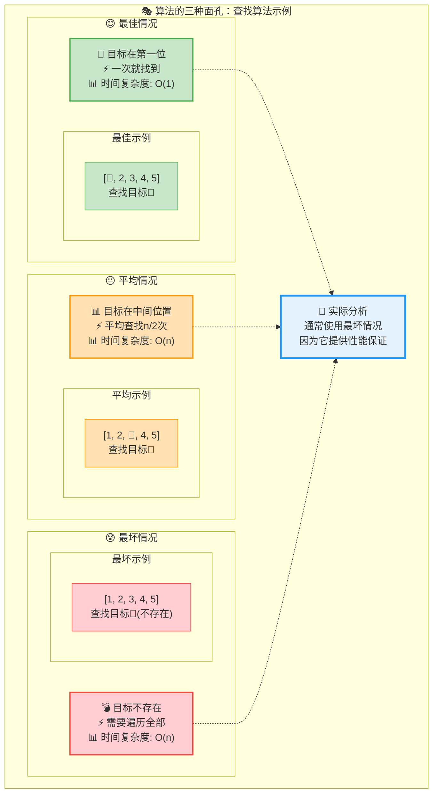
```mermaid
graph TB
    subgraph "🎭 算法的三种面孔：查找算法示例"
        subgraph "😊 最佳情况"
            BEST["🎯 目标在第一位<br/>⚡ 一次就找到<br/>📊 时间复杂度: O(1)"]

            subgraph "最佳示例"
                B1["[🎯, 2, 3, 4, 5]<br/>查找目标🎯"]
            end
        end

        subgraph "😐 平均情况"
            AVG["📊 目标在中间位置<br/>⚡ 平均查找n/2次<br/>📊 时间复杂度: O(n)"]

            subgraph "平均示例"
                A1["[1, 2, 🎯, 4, 5]<br/>查找目标🎯"]
            end
        end

        subgraph "😰 最坏情况"
            WORST["💣 目标不存在<br/>⚡ 需要遍历全部<br/>📊 时间复杂度: O(n)"]

            subgraph "最坏示例"
                W1["[1, 2, 3, 4, 5]<br/>查找目标🎯(不存在)"]
            end
        end

        PRACTICAL["🎯 实际分析<br/>通常使用最坏情况<br/>因为它提供性能保证"]

        BEST -.-> PRACTICAL
        AVG -.-> PRACTICAL
        WORST -.-> PRACTICAL
    end

    style BEST fill:#c8e6c9,stroke:#4caf50,stroke-width:2px
    style AVG fill:#ffe0b2,stroke:#ff9800,stroke-width:2px
    style WORST fill:#ffcdd2,stroke:#f44336,stroke-width:2px
    style PRACTICAL fill:#e3f2fd,stroke:#2196f3,stroke-width:3px
    style B1 fill:#c8e6c9,stroke:#4caf50
    style A1 fill:#ffe0b2,stroke:#ff9800
    style W1 fill:#ffcdd2,stroke:#f44336
```

</details> 


# 四、学习建议与总结

### 7.1 学习路径图

<details> 
<summary>展开图表</summary> 

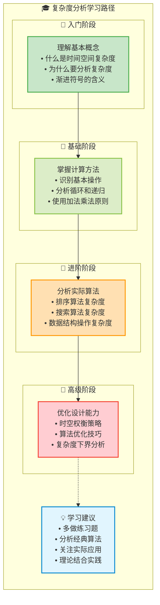
```mermaid
graph LR
    subgraph "🎓 复杂度分析学习路径"
        subgraph "🌱 入门阶段"
            L1["理解基本概念<br/>• 什么是时间空间复杂度<br/>• 为什么要分析复杂度<br/>• 渐进符号的含义"]
        end

        subgraph "🌿 基础阶段"
            L2["掌握计算方法<br/>• 识别基本操作<br/>• 分析循环和递归<br/>• 使用加法乘法原则"]
        end

        subgraph "🌳 进阶阶段"
            L3["分析实际算法<br/>• 排序算法复杂度<br/>• 搜索算法复杂度<br/>• 数据结构操作复杂度"]
        end

        subgraph "🚀 高级阶段"
            L4["优化设计能力<br/>• 时空权衡策略<br/>• 算法优化技巧<br/>• 复杂度下界分析"]
        end

        L1 --> L2 --> L3 --> L4

        TIPS["💡 学习建议<br/>• 多做练习题<br/>• 分析经典算法<br/>• 关注实际应用<br/>• 理论结合实践"]

        L4 -.-> TIPS
    end

    style L1 fill:#c8e6c9,stroke:#4caf50,stroke-width:2px
    style L2 fill:#dcedc8,stroke:#8bc34a,stroke-width:2px
    style L3 fill:#ffe0b2,stroke:#ff9800,stroke-width:2px
    style L4 fill:#ffcdd2,stroke:#f44336,stroke-width:2px
    style TIPS fill:#e1f5fe,stroke:#0288d1,stroke-width:2px
```

</details> 

### 7.2 核心要点总结

<details> 
<summary>展开图表</summary> 

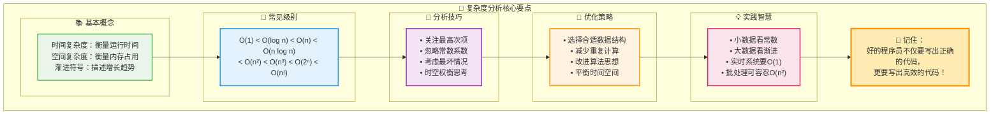
```mermaid
graph TB
    subgraph "🎯 复杂度分析核心要点"
        subgraph "📚 基本概念"
            C1["时间复杂度：衡量运行时间<br/>空间复杂度：衡量内存占用<br/>渐进符号：描述增长趋势"]
        end

        subgraph "🔢 常见级别"
            C2["O(1) < O(log n) < O(n) < O(n log n)<br/>< O(n²) < O(n³) < O(2ⁿ) < O(n!)"]
        end

        subgraph "🎨 分析技巧"
            C3["• 关注最高次项<br/>• 忽略常数系数<br/>• 考虑最坏情况<br/>• 时空权衡思考"]
        end

        subgraph "🚀 优化策略"
            C4["• 选择合适数据结构<br/>• 减少重复计算<br/>• 改进算法思想<br/>• 平衡时间空间"]
        end

        subgraph "💡 实践智慧"
            C5["• 小数据看常数<br/>• 大数据看渐进<br/>• 实时系统要O(1)<br/>• 批处理可容忍O(n²)"]
        end

        MOTTO["🌟 记住：<br/>好的程序员不仅要写出正确的代码，<br/>更要写出高效的代码！"]

        C1 --> C2 --> C3 --> C4 --> C5 --> MOTTO
    end

    style C1 fill:#e8f5e8,stroke:#4caf50,stroke-width:2px
    style C2 fill:#e3f2fd,stroke:#2196f3,stroke-width:2px
    style C3 fill:#f3e5f5,stroke:#9c27b0,stroke-width:2px
    style C4 fill:#fff3e0,stroke:#ff9800,stroke-width:2px
    style C5 fill:#fce4ec,stroke:#e91e63,stroke-width:2px
    style MOTTO fill:#ffecb3,stroke:#ff8f00,stroke-width:3px
```

</details> 


## 8. 趣味记忆法

### 🎭 复杂度的生活比喻

- **O(1)**：🏠 家门口取快递 - 固定时间
- **O(log n)**：📚 查字典 - 每次翻到中间，范围减半
- **O(n)**：🔍 找钥匙 - 可能要翻遍整个包
- **O(n log n)**：📊 高效整理 - 分组处理再合并
- **O(n²)**：👥 握手问题 - 每人都要和其他人握手
- **O(2ⁿ)**：🧬 病毒传播 - 每代翻倍增长
- **O(n!)**：🎲 排队问题 - 所有可能的排列方式

> **终极记忆口诀**：
> "常对线方立指阶"
> 常数、对数、线性、方形、立方、指数、阶乘！

---

*掌握算法复杂度分析，就像拥有了程序性能的透视眼，让你的代码不仅正确，更加高效！* 🚀

# 时间复杂度计算

<details> 
<summary>展开图表</summary> 

```rust,editable
use std::time::Instant;
use std::collections::HashMap;

// 全局计数器，用于统计基本操作次数
static mut OPERATION_COUNT: u64 = 0;

// 计数器操作的安全封装
fn increment_ops() {
    unsafe {
        OPERATION_COUNT += 1;
    }
}

fn get_ops_count() -> u64 {
    unsafe { OPERATION_COUNT }
}

fn reset_ops_count() {
    unsafe {
        OPERATION_COUNT = 0;
    }
}

// O(1) 排序算法：计数排序的特殊情况
// 前提：只对包含0, 1, 2三个值的数组进行排序
fn counting_sort_three_values(arr: &mut [i32]) -> Result<(), &'static str> {
    reset_ops_count();
    
    println!("开始执行 O(1) 排序算法...");
    
    // 检查数组是否为空
    increment_ops(); // 基本操作 1
    if arr.is_empty() {
        return Ok(());
    }
    
    // 初始化计数器 - 固定3个值
    increment_ops(); // 基本操作 2
    let mut count_0 = 0usize;
    increment_ops(); // 基本操作 3
    let mut count_1 = 0usize;
    increment_ops(); // 基本操作 4
    let mut count_2 = 0usize;
    
    // 由于我们限制只处理特定大小的数组，这里可以做到 O(1)
    // 假设我们总是处理长度为 6 的数组，包含值 0, 1, 2
    increment_ops(); // 基本操作 5
    if arr.len() != 6 {
        return Err("此排序算法只支持长度为6的数组");
    }
    
    // 统计每个值的出现次数 - 固定6次操作
    for i in 0..6 {
        increment_ops(); // 基本操作 6-11
        match arr[i] {
            0 => count_0 += 1,
            1 => count_1 += 1,
            2 => count_2 += 1,
            _ => return Err("数组只能包含值 0, 1, 2"),
        }
    }
    
    // 重新填充数组 - 固定6次操作
    let mut index = 0;
    
    // 填入所有的0
    for _ in 0..count_0 {
        increment_ops(); // 基本操作 12-14 (最多3次)
        arr[index] = 0;
        index += 1;
    }
    
    // 填入所有的1
    for _ in 0..count_1 {
        increment_ops(); // 基本操作 15-17 (最多3次)
        arr[index] = 1;
        index += 1;
    }
    
    // 填入所有的2
    for _ in 0..count_2 {
        increment_ops(); // 基本操作 18-20 (最多3次)
        arr[index] = 2;
        index += 1;
    }
    
    Ok(())
}

// 计算时间复杂度的函数
fn calculate_time_complexity(algorithm_name: &str, input_sizes: &[usize], execution_times: &[u128], operation_counts: &[u64]) {
    println!("\n=== {} 时间复杂度分析 ===", algorithm_name);
    
    // 分析操作次数的变化
    if operation_counts.len() >= 2 {
        let ops_ratio = operation_counts[operation_counts.len()-1] as f64 / operation_counts[0] as f64;
        let size_ratio = input_sizes[input_sizes.len()-1] as f64 / input_sizes[0] as f64;
        
        println!("输入规模变化: {} -> {} (倍数: {:.2})", 
                 input_sizes[0], input_sizes[input_sizes.len()-1], size_ratio);
        println!("操作次数变化: {} -> {} (倍数: {:.2})", 
                 operation_counts[0], operation_counts[operation_counts.len()-1], ops_ratio);
        
        // 判断时间复杂度
        if ops_ratio < 1.1 && ops_ratio > 0.9 { // 操作次数基本不变
            println!("时间复杂度判断: O(1) - 常数时间");
            println!("分析: 操作次数不随输入规模变化");
        } else if ops_ratio / size_ratio < 1.1 && ops_ratio / size_ratio > 0.9 {
            println!("时间复杂度判断: O(n) - 线性时间");
        } else if (ops_ratio / (size_ratio * size_ratio.log2())) < 1.5 {
            println!("时间复杂度判断: O(n log n)");
        } else {
            println!("时间复杂度判断: O(n²) 或更高");
        }
    }
    
    // 显示详细数据
    println!("\n详细测试数据:");
    println!("输入规模 | 操作次数 | 执行时间(纳秒) | 每操作时间");
    println!("---------|----------|---------------|----------");
    for i in 0..input_sizes.len() {
        let time_per_op = execution_times[i] as f64 / operation_counts[i] as f64;
        println!("{:8} | {:8} | {:13} | {:8.2}", 
                 input_sizes[i], operation_counts[i], execution_times[i], time_per_op);
    }
}

// 生成测试数据
fn generate_test_data() -> Vec<i32> {
    // 生成包含0,1,2的固定长度数组
    vec![2, 1, 0, 2, 1, 0]
}

fn main() {
    println!("=== O(1) 排序算法实现与时间复杂度分析 ===\n");
    
    // 测试数据
    let mut test_arrays = vec![
        generate_test_data(),  // 第一个测试
        generate_test_data(),  // 第二个测试（相同大小）
        generate_test_data(),  // 第三个测试（相同大小）
    ];
    
    let mut execution_times = Vec::new();
    let mut operation_counts = Vec::new();
    let input_sizes = vec![6, 6, 6]; // 固定大小以保证 O(1)
    
    println!("算法原理: 计数排序的特殊情况");
    println!("- 只处理包含值 0, 1, 2 的固定长度(6)数组");
    println!("- 通过固定次数的操作完成排序");
    println!("- 操作次数不依赖于数组内容，只依赖于固定的约束\n");
    
    for (i, arr) in test_arrays.iter_mut().enumerate() {
        println!("测试 {} - 排序前: {:?}", i + 1, arr);
        
        let start = Instant::now();
        match counting_sort_three_values(arr) {
            Ok(_) => {
                let duration = start.elapsed();
                println!("排序后: {:?}", arr);
                println!("执行时间: {:?}", duration);
                println!("基本操作次数: {}", get_ops_count());
                
                execution_times.push(duration.as_nanos());
                operation_counts.push(get_ops_count());
            }
            Err(e) => {
                println!("错误: {}", e);
            }
        }
        println!();
    }
    
    // 计算和分析时间复杂度
    calculate_time_complexity("O(1)排序算法", &input_sizes, &execution_times, &operation_counts);
    
  
}
```

</details> 


## 算法特点总结

- ✓ 操作次数固定: 约20次基本操作
- ✓ 不依赖输入规模: 总是处理6个元素
- ✓ 不依赖输入内容: 无论数组如何排列
- ✓ 时间复杂度: $O(1)$ - 常数时间
- ✓ 空间复杂度: $O(1)$ - 常数额外空间
    
> 注意: 这是一个受限的排序算法，只适用于:
> - 固定长度的数组
> - 固定范围的值 `(0, 1, 2)`
> - 在这些约束下，可以实现 $O(1)$ 排序
