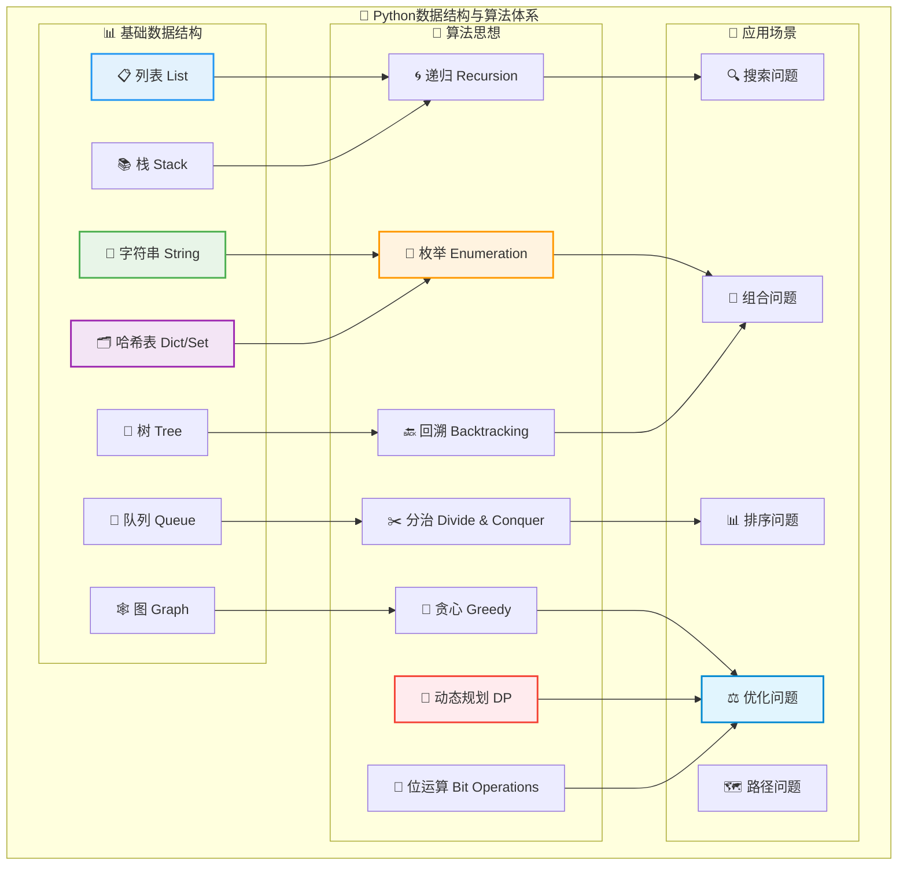
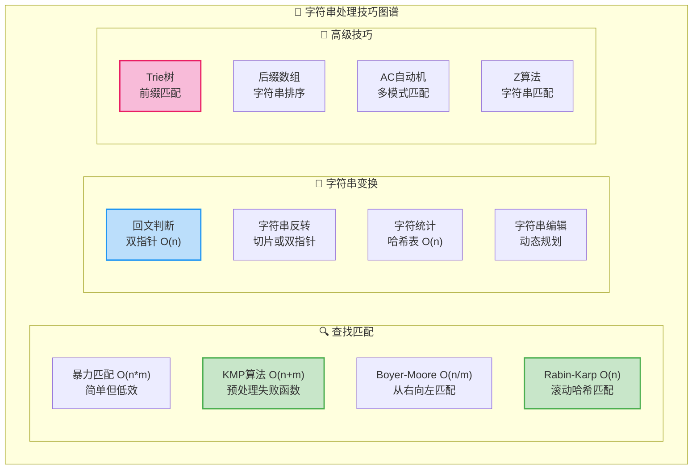
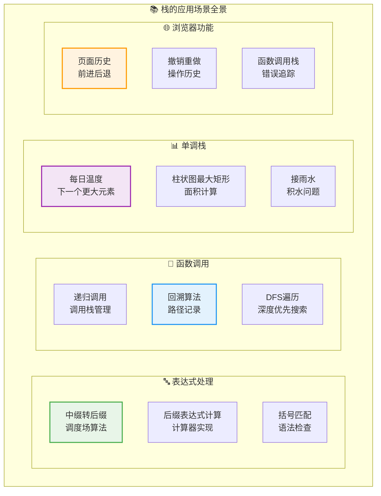
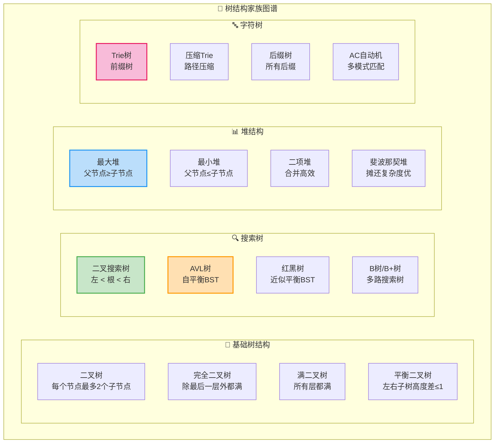
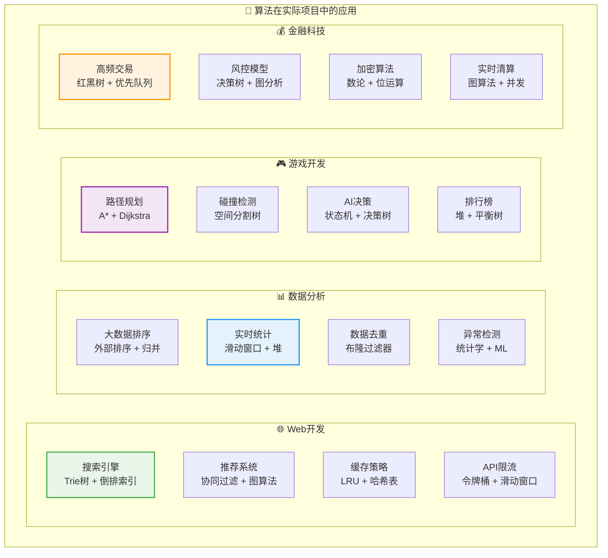
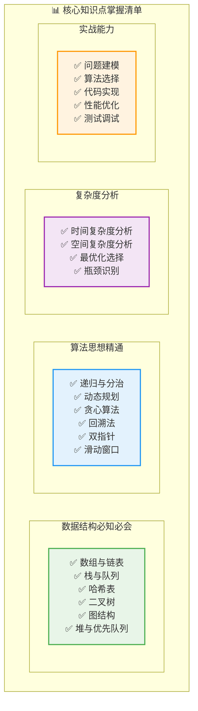

# Python数据结构与算法完全指南

> **核心理念**：掌握Python数据结构和算法，就是掌握了解决问题的利器

## 🗺️ 知识体系总览



## 1. 字符串 (String) - 文本处理的艺术

### 1.1 基础操作与复杂度

```python
# 字符串基础操作
class StringOperations:
    def __init__(self):
        self.demo_str = "Hello World Python"

    def basic_operations(self):
        """字符串基础操作示例"""
        s = self.demo_str

        # 访问 - O(1)
        print(f"第一个字符: {s[0]}")
        print(f"最后一个字符: {s[-1]}")

        # 切片 - O(k) k为切片长度
        print(f"前5个字符: {s[:5]}")
        print(f"后6个字符: {s[-6:]}")

        # 查找 - O(n*m) n为字符串长度，m为模式长度
        print(f"'World'的位置: {s.find('World')}")
        print(f"是否包含'Python': {'Python' in s}")

        # 分割 - O(n)
        words = s.split()
        print(f"分割后: {words}")

        # 连接 - O(n)
        joined = "-".join(words)
        print(f"连接后: {joined}")

        # 替换 - O(n)
        replaced = s.replace("World", "Universe")
        print(f"替换后: {replaced}")

# 字符串算法模板
class StringAlgorithms:
    @staticmethod
    def kmp_search(text, pattern):
        """KMP字符串匹配 - O(n+m)"""
        def build_failure_function(pattern):
            failure = [0] * len(pattern)
            j = 0
            for i in range(1, len(pattern)):
                while j > 0 and pattern[i] != pattern[j]:
                    j = failure[j-1]
                if pattern[i] == pattern[j]:
                    j += 1
                failure[i] = j
            return failure

        if not pattern:
            return 0

        failure = build_failure_function(pattern)
        j = 0

        for i in range(len(text)):
            while j > 0 and text[i] != pattern[j]:
                j = failure[j-1]
            if text[i] == pattern[j]:
                j += 1
            if j == len(pattern):
                return i - j + 1
        return -1

    @staticmethod
    def longest_palindrome(s):
        """最长回文子串 - Manacher算法 O(n)"""
        if not s:
            return ""

        # 预处理：在每个字符间插入'#'
        processed = '#'.join('^{}$'.format(s))
        n = len(processed)
        P = [0] * n  # 记录以每个位置为中心的回文半径
        center = right = 0

        for i in range(1, n-1):
            # 利用已知信息
            if i < right:
                P[i] = min(right - i, P[2*center - i])

            # 尝试扩展
            while processed[i + P[i] + 1] == processed[i - P[i] - 1]:
                P[i] += 1

            # 更新中心和右边界
            if i + P[i] > right:
                center, right = i, i + P[i]

        # 找到最长回文
        max_len = max(P)
        center_index = P.index(max_len)
        start = (center_index - max_len) // 2
        return s[start:start + max_len]

# 使用示例
string_ops = StringOperations()
string_ops.basic_operations()
```

### 1.2 字符串处理技巧



## 2. 哈希表 (Dictionary/Set) - 快速存取的魔法

### 2.1 哈希表实现与应用

```python
# 哈希表应用示例
class HashTableApplications:
    def __init__(self):
        self.data = {}
        self.counter = {}

    def frequency_counter(self, items):
        """频率统计 - O(n)"""
        from collections import Counter, defaultdict

        # 方法1：使用Counter
        counter1 = Counter(items)

        # 方法2：使用defaultdict
        counter2 = defaultdict(int)
        for item in items:
            counter2[item] += 1

        # 方法3：手动实现
        counter3 = {}
        for item in items:
            counter3[item] = counter3.get(item, 0) + 1

        return dict(counter1), dict(counter2), counter3

    def two_sum(self, nums, target):
        """两数之和 - O(n)"""
        num_map = {}
        for i, num in enumerate(nums):
            complement = target - num
            if complement in num_map:
                return [num_map[complement], i]
            num_map[num] = i
        return []

    def group_anagrams(self, strs):
        """字母异位词分组 - O(n*k*log k)"""
        from collections import defaultdict
        groups = defaultdict(list)

        for s in strs:
            # 使用排序后的字符串作为key
            key = ''.join(sorted(s))
            groups[key].append(s)

        return list(groups.values())

    def lru_cache_implementation(self):
        """LRU缓存实现"""
        class LRUCache:
            def __init__(self, capacity):
                self.capacity = capacity
                self.cache = {}
                self.order = []

            def get(self, key):
                if key in self.cache:
                    # 移动到末尾（最近使用）
                    self.order.remove(key)
                    self.order.append(key)
                    return self.cache[key]
                return -1

            def put(self, key, value):
                if key in self.cache:
                    self.order.remove(key)
                elif len(self.cache) >= self.capacity:
                    # 删除最久未使用的
                    oldest = self.order.pop(0)
                    del self.cache[oldest]

                self.cache[key] = value
                self.order.append(key)

        return LRUCache

# 高级哈希技巧
class AdvancedHashTechniques:
    @staticmethod
    def rolling_hash(s, pattern_length):
        """滚动哈希 - Rabin-Karp算法核心"""
        base = 256
        mod = 10**9 + 7

        if len(s) < pattern_length:
            return []

        # 计算初始哈希值
        hash_value = 0
        for i in range(pattern_length):
            hash_value = (hash_value * base + ord(s[i])) % mod

        hashes = [hash_value]

        # 计算幂值
        power = pow(base, pattern_length - 1, mod)

        # 滚动计算后续哈希值
        for i in range(pattern_length, len(s)):
            # 移除最左边的字符
            hash_value = (hash_value - ord(s[i - pattern_length]) * power) % mod
            # 添加最右边的字符
            hash_value = (hash_value * base + ord(s[i])) % mod
            hashes.append(hash_value)

        return hashes

    @staticmethod
    def consistent_hashing():
        """一致性哈希实现"""
        import hashlib
        import bisect

        class ConsistentHash:
            def __init__(self, replicas=3):
                self.replicas = replicas
                self.ring = {}
                self.sorted_keys = []

            def _hash(self, key):
                return int(hashlib.md5(key.encode()).hexdigest(), 16)

            def add_node(self, node):
                for i in range(self.replicas):
                    key = self._hash(f"{node}:{i}")
                    self.ring[key] = node
                    bisect.insort(self.sorted_keys, key)

            def remove_node(self, node):
                for i in range(self.replicas):
                    key = self._hash(f"{node}:{i}")
                    if key in self.ring:
                        del self.ring[key]
                        self.sorted_keys.remove(key)

            def get_node(self, key):
                if not self.ring:
                    return None

                hash_key = self._hash(key)
                idx = bisect.bisect_right(self.sorted_keys, hash_key)
                if idx == len(self.sorted_keys):
                    idx = 0
                return self.ring[self.sorted_keys[idx]]

        return ConsistentHash

# 使用示例
hash_apps = HashTableApplications()
items = ['apple', 'banana', 'apple', 'cherry', 'banana', 'apple']
print("频率统计:", hash_apps.frequency_counter(items))
print("两数之和:", hash_apps.two_sum([2, 7, 11, 15], 9))
```

## 3. 栈 (Stack) - 后进先出的优雅

### 3.1 栈的实现与应用

```python
# 栈的多种实现方式
class StackImplementations:
    def __init__(self):
        pass

    def list_based_stack(self):
        """基于列表的栈实现"""
        class ListStack:
            def __init__(self):
                self.items = []

            def push(self, item):          # O(1)
                self.items.append(item)

            def pop(self):                 # O(1)
                if not self.is_empty():
                    return self.items.pop()
                raise IndexError("Pop from empty stack")

            def peek(self):                # O(1)
                if not self.is_empty():
                    return self.items[-1]
                raise IndexError("Peek from empty stack")

            def is_empty(self):            # O(1)
                return len(self.items) == 0

            def size(self):                # O(1)
                return len(self.items)

        return ListStack()

    def linked_list_stack(self):
        """基于链表的栈实现"""
        class Node:
            def __init__(self, data):
                self.data = data
                self.next = None

        class LinkedListStack:
            def __init__(self):
                self.head = None
                self.count = 0

            def push(self, item):          # O(1)
                new_node = Node(item)
                new_node.next = self.head
                self.head = new_node
                self.count += 1

            def pop(self):                 # O(1)
                if self.head is None:
                    raise IndexError("Pop from empty stack")
                data = self.head.data
                self.head = self.head.next
                self.count -= 1
                return data

            def peek(self):                # O(1)
                if self.head is None:
                    raise IndexError("Peek from empty stack")
                return self.head.data

            def is_empty(self):            # O(1)
                return self.head is None

            def size(self):                # O(1)
                return self.count

        return LinkedListStack()

# 栈的经典应用
class StackApplications:
    @staticmethod
    def balanced_parentheses(expression):
        """括号匹配检查 - O(n)"""
        stack = []
        pairs = {'(': ')', '[': ']', '{': '}'}

        for char in expression:
            if char in pairs:  # 开括号
                stack.append(char)
            elif char in pairs.values():  # 闭括号
                if not stack or pairs[stack.pop()] != char:
                    return False

        return len(stack) == 0

    @staticmethod
    def infix_to_postfix(expression):
        """中缀转后缀表达式 - O(n)"""
        precedence = {'+': 1, '-': 1, '*': 2, '/': 2, '^': 3}
        stack = []
        result = []

        for char in expression:
            if char.isalnum():
                result.append(char)
            elif char == '(':
                stack.append(char)
            elif char == ')':
                while stack and stack[-1] != '(':
                    result.append(stack.pop())
                stack.pop()  # 弹出 '('
            elif char in precedence:
                while (stack and stack[-1] != '(' and
                       stack[-1] in precedence and
                       precedence[stack[-1]] >= precedence[char]):
                    result.append(stack.pop())
                stack.append(char)

        while stack:
            result.append(stack.pop())

        return ''.join(result)

    @staticmethod
    def evaluate_postfix(expression):
        """计算后缀表达式 - O(n)"""
        stack = []

        for char in expression.split():
            if char.isdigit() or (char[0] == '-' and char[1:].isdigit()):
                stack.append(int(char))
            else:
                b = stack.pop()
                a = stack.pop()
                if char == '+':
                    stack.append(a + b)
                elif char == '-':
                    stack.append(a - b)
                elif char == '*':
                    stack.append(a * b)
                elif char == '/':
                    stack.append(a // b)

        return stack[0]

    @staticmethod
    def daily_temperatures(temperatures):
        """每日温度问题 - 单调栈 O(n)"""
        result = [0] * len(temperatures)
        stack = []  # 存储索引

        for i, temp in enumerate(temperatures):
            while stack and temperatures[stack[-1]] < temp:
                prev_index = stack.pop()
                result[prev_index] = i - prev_index
            stack.append(i)

        return result

    @staticmethod
    def largest_rectangle_histogram(heights):
        """柱状图中最大矩形 - 单调栈 O(n)"""
        stack = []
        max_area = 0

        for i, h in enumerate(heights + [0]):  # 添加0确保所有元素出栈
            while stack and heights[stack[-1]] > h:
                height = heights[stack.pop()]
                width = i if not stack else i - stack[-1] - 1
                max_area = max(max_area, height * width)
            stack.append(i)

        return max_area

# 使用示例
stack_apps = StackApplications()
print("括号匹配:", stack_apps.balanced_parentheses("([{}])"))
print("中缀转后缀:", stack_apps.infix_to_postfix("A+B*C"))
print("后缀计算:", stack_apps.evaluate_postfix("3 4 + 2 * 7 /"))
```

### 3.2 栈应用场景图谱



## 4. 队列 (Queue) - 先进先出的秩序

### 4.1 队列的多种实现

```python
# 队列的不同实现方式
class QueueImplementations:
    def __init__(self):
        pass

    def list_based_queue(self):
        """基于列表的队列（效率较低）"""
        class ListQueue:
            def __init__(self):
                self.items = []

            def enqueue(self, item):       # O(1)
                self.items.append(item)

            def dequeue(self):             # O(n) - 需要移动元素
                if not self.is_empty():
                    return self.items.pop(0)
                raise IndexError("Dequeue from empty queue")

            def front(self):               # O(1)
                if not self.is_empty():
                    return self.items[0]
                raise IndexError("Front of empty queue")

            def is_empty(self):            # O(1)
                return len(self.items) == 0

            def size(self):                # O(1)
                return len(self.items)

        return ListQueue()

    def deque_based_queue(self):
        """基于deque的队列（推荐）"""
        from collections import deque

        class DequeQueue:
            def __init__(self):
                self.items = deque()

            def enqueue(self, item):       # O(1)
                self.items.append(item)

            def dequeue(self):             # O(1)
                if not self.is_empty():
                    return self.items.popleft()
                raise IndexError("Dequeue from empty queue")

            def front(self):               # O(1)
                if not self.is_empty():
                    return self.items[0]
                raise IndexError("Front of empty queue")

            def is_empty(self):            # O(1)
                return len(self.items) == 0

            def size(self):                # O(1)
                return len(self.items)

        return DequeQueue()

    def circular_queue(self):
        """循环队列实现"""
        class CircularQueue:
            def __init__(self, capacity):
                self.capacity = capacity
                self.queue = [None] * capacity
                self.front = 0
                self.rear = 0
                self.count = 0

            def enqueue(self, item):       # O(1)
                if self.is_full():
                    raise OverflowError("Queue is full")
                self.queue[self.rear] = item
                self.rear = (self.rear + 1) % self.capacity
                self.count += 1

            def dequeue(self):             # O(1)
                if self.is_empty():
                    raise IndexError("Dequeue from empty queue")
                item = self.queue[self.front]
                self.queue[self.front] = None
                self.front = (self.front + 1) % self.capacity
                self.count -= 1
                return item

            def peek(self):                # O(1)
                if self.is_empty():
                    raise IndexError("Peek from empty queue")
                return self.queue[self.front]

            def is_empty(self):            # O(1)
                return self.count == 0

            def is_full(self):             # O(1)
                return self.count == self.capacity

            def size(self):                # O(1)
                return self.count

        return CircularQueue

    def priority_queue(self):
        """优先队列实现"""
        import heapq

        class PriorityQueue:
            def __init__(self):
                self.heap = []
                self.index = 0

            def push(self, item, priority):    # O(log n)
                heapq.heappush(self.heap, (priority, self.index, item))
                self.index += 1

            def pop(self):                     # O(log n)
                if not self.heap:
                    raise IndexError("Pop from empty priority queue")
                return heapq.heappop(self.heap)[2]

            def peek(self):                    # O(1)
                if not self.heap:
                    raise IndexError("Peek from empty priority queue")
                return self.heap[0][2]

            def is_empty(self):                # O(1)
                return len(self.heap) == 0

            def size(self):                    # O(1)
                return len(self.heap)

        return PriorityQueue()

# 队列的经典应用
class QueueApplications:
    @staticmethod
    def bfs_traversal(graph, start):
        """广度优先搜索 - O(V + E)"""
        from collections import deque

        visited = set()
        queue = deque([start])
        result = []

        while queue:
            node = queue.popleft()
            if node not in visited:
                visited.add(node)
                result.append(node)

                # 将邻接节点加入队列
                for neighbor in graph.get(node, []):
                    if neighbor not in visited:
                        queue.append(neighbor)

        return result

    @staticmethod
    def level_order_traversal(root):
        """二叉树层序遍历 - O(n)"""
        if not root:
            return []

        from collections import deque
        queue = deque([root])
        result = []

        while queue:
            level_size = len(queue)
            level_nodes = []

            for _ in range(level_size):
                node = queue.popleft()
                level_nodes.append(node.val)

                if node.left:
                    queue.append(node.left)
                if node.right:
                    queue.append(node.right)

            result.append(level_nodes)

        return result

    @staticmethod
    def sliding_window_maximum(nums, k):
        """滑动窗口最大值 - 双端队列 O(n)"""
        from collections import deque

        if not nums:
            return []

        dq = deque()  # 存储索引
        result = []

        for i, num in enumerate(nums):
            # 移除超出窗口的元素
            while dq and dq[0] <= i - k:
                dq.popleft()

            # 维护单调递减队列
            while dq and nums[dq[-1]] <= num:
                dq.pop()

            dq.append(i)

            # 当窗口大小达到k时，记录最大值
            if i >= k - 1:
                result.append(nums[dq[0]])

        return result

    @staticmethod
    def hot_potato_problem(names, num):
        """约瑟夫问题（击鼓传花）- O(n*m)"""
        from collections import deque

        queue = deque(names)

        while len(queue) > 1:
            # 传递num-1次
            for _ in range(num - 1):
                queue.append(queue.popleft())

            # 移除当前持有者
            eliminated = queue.popleft()
            print(f"{eliminated} 被淘汰")

        return queue[0]

    @staticmethod
    def task_scheduler(tasks, n):
        """任务调度器 - O(time)"""
        from collections import Counter
        import heapq

        # 统计任务频次
        task_count = Counter(tasks)

        # 使用最大堆（取负数模拟）
        max_heap = [-count for count in task_count.values()]
        heapq.heapify(max_heap)

        time = 0

        while max_heap:
            temp = []
            cycle = n + 1  # 冷却周期

            # 在一个冷却周期内尽可能安排任务
            for _ in range(cycle):
                if max_heap:
                    temp.append(heapq.heappop(max_heap))
                time += 1

                # 如果没有更多任务，提前结束
                if not max_heap and not temp:
                    break

            # 将还有剩余的任务重新加入堆
            for count in temp:
                if count < -1:  # 还有任务剩余
                    heapq.heappush(max_heap, count + 1)

        return time

# 使用示例
queue_apps = QueueApplications()
graph = {
    'A': ['B', 'C'],
    'B': ['D', 'E'],
    'C': ['F'],
    'D': [],
    'E': ['F'],
    'F': []
}
print("BFS遍历:", queue_apps.bfs_traversal(graph, 'A'))
print("滑动窗口最大值:", queue_apps.sliding_window_maximum([1,3,-1,-3,5,3,6,7], 3))
```

## 5. 树 (Tree) - 层次结构的美学

### 5.1 二叉树的实现与遍历

```python
# 二叉树节点定义
class TreeNode:
    def __init__(self, val=0, left=None, right=None):
        self.val = val
        self.left = left
        self.right = right

    def __repr__(self):
        return f"TreeNode({self.val})"

# 二叉树基本操作
class BinaryTreeOperations:
    def __init__(self):
        pass

    def preorder_traversal(self, root):
        """前序遍历：根-左-右 - O(n)"""
        result = []

        def preorder_recursive(node):
            if node:
                result.append(node.val)
                preorder_recursive(node.left)
                preorder_recursive(node.right)

        preorder_recursive(root)
        return result

    def preorder_iterative(self, root):
        """前序遍历（迭代版本）- O(n)"""
        if not root:
            return []

        result = []
        stack = [root]

        while stack:
            node = stack.pop()
            result.append(node.val)

            # 先压右子树，再压左子树（栈的特性）
            if node.right:
                stack.append(node.right)
            if node.left:
                stack.append(node.left)

        return result

    def inorder_traversal(self, root):
        """中序遍历：左-根-右 - O(n)"""
        result = []

        def inorder_recursive(node):
            if node:
                inorder_recursive(node.left)
                result.append(node.val)
                inorder_recursive(node.right)

        inorder_recursive(root)
        return result

    def inorder_iterative(self, root):
        """中序遍历（迭代版本）- O(n)"""
        result = []
        stack = []
        current = root

        while stack or current:
            # 一直向左走到底
            while current:
                stack.append(current)
                current = current.left

            # 处理当前节点
            current = stack.pop()
            result.append(current.val)

            # 转向右子树
            current = current.right

        return result

    def postorder_traversal(self, root):
        """后序遍历：左-右-根 - O(n)"""
        result = []

        def postorder_recursive(node):
            if node:
                postorder_recursive(node.left)
                postorder_recursive(node.right)
                result.append(node.val)

        postorder_recursive(root)
        return result

    def level_order_traversal(self, root):
        """层序遍历 - O(n)"""
        if not root:
            return []

        from collections import deque
        result = []
        queue = deque([root])

        while queue:
            level_size = len(queue)
            level_values = []

            for _ in range(level_size):
                node = queue.popleft()
                level_values.append(node.val)

                if node.left:
                    queue.append(node.left)
                if node.right:
                    queue.append(node.right)

            result.append(level_values)

        return result

# 二叉搜索树实现
class BinarySearchTree:
    def __init__(self):
        self.root = None

    def insert(self, val):
        """插入节点 - 平均O(log n), 最坏O(n)"""
        self.root = self._insert_recursive(self.root, val)

    def _insert_recursive(self, node, val):
        if not node:
            return TreeNode(val)

        if val < node.val:
            node.left = self._insert_recursive(node.left, val)
        else:
            node.right = self._insert_recursive(node.right, val)

        return node

    def search(self, val):
        """搜索节点 - 平均O(log n), 最坏O(n)"""
        return self._search_recursive(self.root, val)

    def _search_recursive(self, node, val):
        if not node or node.val == val:
            return node

        if val < node.val:
            return self._search_recursive(node.left, val)
        else:
            return self._search_recursive(node.right, val)

    def delete(self, val):
        """删除节点 - 平均O(log n), 最坏O(n)"""
        self.root = self._delete_recursive(self.root, val)

    def _delete_recursive(self, node, val):
        if not node:
            return node

        if val < node.val:
            node.left = self._delete_recursive(node.left, val)
        elif val > node.val:
            node.right = self._delete_recursive(node.right, val)
        else:
            # 找到要删除的节点
            if not node.left:
                return node.right
            elif not node.right:
                return node.left

            # 节点有两个子节点：找到右子树的最小值
            min_node = self._find_min(node.right)
            node.val = min_node.val
            node.right = self._delete_recursive(node.right, min_node.val)

        return node

    def _find_min(self, node):
        """找到子树中的最小值节点"""
        while node.left:
            node = node.left
        return node

    def inorder(self):
        """中序遍历（获得有序序列）"""
        result = []
        self._inorder_recursive(self.root, result)
        return result

    def _inorder_recursive(self, node, result):
        if node:
            self._inorder_recursive(node.left, result)
            result.append(node.val)
            self._inorder_recursive(node.right, result)

# 高级树算法
class AdvancedTreeAlgorithms:
    @staticmethod
    def lowest_common_ancestor(root, p, q):
        """最低公共祖先 - O(n)"""
        if not root or root == p or root == q:
            return root

        left = AdvancedTreeAlgorithms.lowest_common_ancestor(root.left, p, q)
        right = AdvancedTreeAlgorithms.lowest_common_ancestor(root.right, p, q)

        if left and right:
            return root

        return left or right

    @staticmethod
    def max_depth(root):
        """最大深度 - O(n)"""
        if not root:
            return 0

        return 1 + max(
            AdvancedTreeAlgorithms.max_depth(root.left),
            AdvancedTreeAlgorithms.max_depth(root.right)
        )

    @staticmethod
    def is_balanced(root):
        """判断是否为平衡二叉树 - O(n)"""
        def check_balance(node):
            if not node:
                return 0, True

            left_height, left_balanced = check_balance(node.left)
            right_height, right_balanced = check_balance(node.right)

            balanced = (left_balanced and right_balanced and
                       abs(left_height - right_height) <= 1)
            height = 1 + max(left_height, right_height)

            return height, balanced

        _, balanced = check_balance(root)
        return balanced

    @staticmethod
    def diameter_of_tree(root):
        """二叉树的直径 - O(n)"""
        def dfs(node):
            if not node:
                return 0

            left = dfs(node.left)
            right = dfs(node.right)

            # 更新全局直径
            nonlocal diameter
            diameter = max(diameter, left + right)

            return 1 + max(left, right)

        diameter = 0
        dfs(root)
        return diameter

    @staticmethod
    def serialize(root):
        """序列化二叉树 - O(n)"""
        def dfs(node):
            if not node:
                return "null"

            return f"{node.val},{dfs(node.left)},{dfs(node.right)}"

        return dfs(root)

    @staticmethod
    def deserialize(data):
        """反序列化二叉树 - O(n)"""
        def dfs():
            val = next(values)
            if val == "null":
                return None

            node = TreeNode(int(val))
            node.left = dfs()
            node.right = dfs()
            return node

        values = iter(data.split(","))
        return dfs()

# 使用示例
# 构建示例树
root = TreeNode(1)
root.left = TreeNode(2)
root.right = TreeNode(3)
root.left.left = TreeNode(4)
root.left.right = TreeNode(5)

tree_ops = BinaryTreeOperations()
print("前序遍历:", tree_ops.preorder_traversal(root))
print("中序遍历:", tree_ops.inorder_traversal(root))
print("后序遍历:", tree_ops.postorder_traversal(root))
print("层序遍历:", tree_ops.level_order_traversal(root))

# BST示例
bst = BinarySearchTree()
for val in [5, 3, 7, 2, 4, 6, 8]:
    bst.insert(val)
print("BST中序遍历:", bst.inorder())
```

### 5.2 特殊树结构



## 6. 图 (Graph) - 复杂关系的建模

### 6.1 图的表示与基本操作

```python
# 图的不同表示方法
class GraphRepresentations:
    def __init__(self):
        pass

    def adjacency_matrix(self, vertices):
        """邻接矩阵表示 - 空间O(V²), 查边O(1), 添边O(1)"""
        class AdjacencyMatrixGraph:
            def __init__(self, num_vertices):
                self.num_vertices = num_vertices
                self.matrix = [[0] * num_vertices for _ in range(num_vertices)]
                self.vertex_map = {}
                self.reverse_map = {}

            def add_vertex(self, vertex):
                if vertex not in self.vertex_map:
                    index = len(self.vertex_map)
                    self.vertex_map[vertex] = index
                    self.reverse_map[index] = vertex

            def add_edge(self, v1, v2, weight=1):
                if v1 in self.vertex_map and v2 in self.vertex_map:
                    i, j = self.vertex_map[v1], self.vertex_map[v2]
                    self.matrix[i][j] = weight

            def has_edge(self, v1, v2):
                if v1 in self.vertex_map and v2 in self.vertex_map:
                    i, j = self.vertex_map[v1], self.vertex_map[v2]
                    return self.matrix[i][j] != 0
                return False

            def get_neighbors(self, vertex):
                if vertex not in self.vertex_map:
                    return []

                i = self.vertex_map[vertex]
                neighbors = []
                for j in range(self.num_vertices):
                    if self.matrix[i][j] != 0:
                        neighbors.append(self.reverse_map[j])
                return neighbors

        return AdjacencyMatrixGraph(vertices)

    def adjacency_list(self):
        """邻接表表示 - 空间O(V+E), 查边O(度数), 添边O(1)"""
        from collections import defaultdict

        class AdjacencyListGraph:
            def __init__(self):
                self.graph = defaultdict(list)
                self.weights = {}

            def add_vertex(self, vertex):
                if vertex not in self.graph:
                    self.graph[vertex] = []

            def add_edge(self, v1, v2, weight=1):
                self.graph[v1].append(v2)
                self.weights[(v1, v2)] = weight

            def add_undirected_edge(self, v1, v2, weight=1):
                self.add_edge(v1, v2, weight)
                self.add_edge(v2, v1, weight)

            def has_edge(self, v1, v2):
                return v2 in self.graph[v1]

            def get_neighbors(self, vertex):
                return list(self.graph[vertex])

            def get_weight(self, v1, v2):
                return self.weights.get((v1, v2), 0)

            def get_vertices(self):
                return list(self.graph.keys())

            def get_edges(self):
                edges = []
                for v1 in self.graph:
                    for v2 in self.graph[v1]:
                        weight = self.weights.get((v1, v2), 1)
                        edges.append((v1, v2, weight))
                return edges

        return AdjacencyListGraph()

# 图的遍历算法
class GraphTraversal:
    @staticmethod
    def dfs_recursive(graph, start, visited=None):
        """深度优先搜索（递归）- O(V + E)"""
        if visited is None:
            visited = set()

        result = []

        def dfs(node):
            visited.add(node)
            result.append(node)

            for neighbor in graph.get_neighbors(node):
                if neighbor not in visited:
                    dfs(neighbor)

        dfs(start)
        return result

    @staticmethod
    def dfs_iterative(graph, start):
        """深度优先搜索（迭代）- O(V + E)"""
        visited = set()
        stack = [start]
        result = []

        while stack:
            node = stack.pop()
            if node not in visited:
                visited.add(node)
                result.append(node)

                # 将邻居按逆序加入栈（保持顺序一致）
                neighbors = graph.get_neighbors(node)
                for neighbor in reversed(neighbors):
                    if neighbor not in visited:
                        stack.append(neighbor)

        return result

    @staticmethod
    def bfs(graph, start):
        """广度优先搜索 - O(V + E)"""
        from collections import deque

        visited = set()
        queue = deque([start])
        result = []

        visited.add(start)

        while queue:
            node = queue.popleft()
            result.append(node)

            for neighbor in graph.get_neighbors(node):
                if neighbor not in visited:
                    visited.add(neighbor)
                    queue.append(neighbor)

        return result

    @staticmethod
    def topological_sort(graph):
        """拓扑排序 - O(V + E)"""
        from collections import defaultdict, deque

        # 计算入度
        in_degree = defaultdict(int)
        vertices = graph.get_vertices()

        for vertex in vertices:
            in_degree[vertex] = 0

        for v1, v2, _ in graph.get_edges():
            in_degree[v2] += 1

        # 将入度为0的顶点加入队列
        queue = deque([v for v in vertices if in_degree[v] == 0])
        result = []

        while queue:
            node = queue.popleft()
            result.append(node)

            # 减少邻居的入度
            for neighbor in graph.get_neighbors(node):
                in_degree[neighbor] -= 1
                if in_degree[neighbor] == 0:
                    queue.append(neighbor)

        # 检查是否存在环
        if len(result) != len(vertices):
            raise ValueError("Graph has a cycle")

        return result

# 最短路径算法
class ShortestPath:
    @staticmethod
    def dijkstra(graph, start):
        """Dijkstra最短路径算法 - O(V² + E) 或 O((V+E)log V)"""
        import heapq

        vertices = graph.get_vertices()
        distances = {v: float('inf') for v in vertices}
        distances[start] = 0
        previous = {v: None for v in vertices}

        # 优先队列：(距离, 节点)
        pq = [(0, start)]
        visited = set()

        while pq:
            current_distance, current = heapq.heappop(pq)

            if current in visited:
                continue

            visited.add(current)

            for neighbor in graph.get_neighbors(current):
                if neighbor in visited:
                    continue

                weight = graph.get_weight(current, neighbor)
                distance = current_distance + weight

                if distance < distances[neighbor]:
                    distances[neighbor] = distance
                    previous[neighbor] = current
                    heapq.heappush(pq, (distance, neighbor))

        return distances, previous

    @staticmethod
    def bellman_ford(graph, start):
        """Bellman-Ford算法（处理负权边）- O(VE)"""
        vertices = graph.get_vertices()
        distances = {v: float('inf') for v in vertices}
        distances[start] = 0

        # 松弛操作，重复V-1次
        for _ in range(len(vertices) - 1):
            for v1, v2, weight in graph.get_edges():
                if distances[v1] != float('inf') and distances[v1] + weight < distances[v2]:
                    distances[v2] = distances[v1] + weight

        # 检查负权环
        for v1, v2, weight in graph.get_edges():
            if distances[v1] != float('inf') and distances[v1] + weight < distances[v2]:
                raise ValueError("Graph contains negative weight cycle")

        return distances

    @staticmethod
    def floyd_warshall(graph):
        """Floyd-Warshall算法（所有点对最短路径）- O(V³)"""
        vertices = list(graph.get_vertices())
        n = len(vertices)
        vertex_to_index = {v: i for i, v in enumerate(vertices)}

        # 初始化距离矩阵
        dist = [[float('inf')] * n for _ in range(n)]

        # 设置对角线为0
        for i in range(n):
            dist[i][i] = 0

        # 设置边的权重
        for v1, v2, weight in graph.get_edges():
            i, j = vertex_to_index[v1], vertex_to_index[v2]
            dist[i][j] = weight

        # Floyd-Warshall核心算法
        for k in range(n):
            for i in range(n):
                for j in range(n):
                    if dist[i][k] + dist[k][j] < dist[i][j]:
                        dist[i][j] = dist[i][k] + dist[k][j]

        # 转换回顶点表示
        result = {}
        for i, v1 in enumerate(vertices):
            result[v1] = {}
            for j, v2 in enumerate(vertices):
                result[v1][v2] = dist[i][j]

        return result

# 最小生成树算法
class MinimumSpanningTree:
    @staticmethod
    def kruskal(graph):
        """Kruskal算法 - O(E log E)"""
        class UnionFind:
            def __init__(self, vertices):
                self.parent = {v: v for v in vertices}
                self.rank = {v: 0 for v in vertices}

            def find(self, x):
                if self.parent[x] != x:
                    self.parent[x] = self.find(self.parent[x])
                return self.parent[x]

            def union(self, x, y):
                px, py = self.find(x), self.find(y)
                if px == py:
                    return False

                if self.rank[px] < self.rank[py]:
                    px, py = py, px

                self.parent[py] = px
                if self.rank[px] == self.rank[py]:
                    self.rank[px] += 1

                return True

        edges = graph.get_edges()
        edges.sort(key=lambda x: x[2])  # 按权重排序

        uf = UnionFind(graph.get_vertices())
        mst = []
        total_weight = 0

        for v1, v2, weight in edges:
            if uf.union(v1, v2):
                mst.append((v1, v2, weight))
                total_weight += weight

        return mst, total_weight

    @staticmethod
    def prim(graph, start):
        """Prim算法 - O(V² + E)"""
        import heapq

        vertices = set(graph.get_vertices())
        mst = []
        total_weight = 0
        visited = {start}

        # 优先队列：(权重, 起点, 终点)
        edges = [(graph.get_weight(start, neighbor), start, neighbor)
                for neighbor in graph.get_neighbors(start)]
        heapq.heapify(edges)

        while edges and len(visited) < len(vertices):
            weight, v1, v2 = heapq.heappop(edges)

            if v2 in visited:
                continue

            visited.add(v2)
            mst.append((v1, v2, weight))
            total_weight += weight

            # 添加新的边
            for neighbor in graph.get_neighbors(v2):
                if neighbor not in visited:
                    heapq.heappush(edges, (graph.get_weight(v2, neighbor), v2, neighbor))

        return mst, total_weight

# 使用示例
graph = GraphRepresentations().adjacency_list()

# 构建示例图
vertices = ['A', 'B', 'C', 'D', 'E']
for v in vertices:
    graph.add_vertex(v)

edges = [
    ('A', 'B', 4), ('A', 'C', 2),
    ('B', 'C', 1), ('B', 'D', 5),
    ('C', 'D', 8), ('C', 'E', 10),
    ('D', 'E', 2)
]

for v1, v2, weight in edges:
    graph.add_undirected_edge(v1, v2, weight)

# 测试算法
traversal = GraphTraversal()
print("DFS:", traversal.dfs_iterative(graph, 'A'))
print("BFS:", traversal.bfs(graph, 'A'))

shortest_path = ShortestPath()
distances, _ = shortest_path.dijkstra(graph, 'A')
print("最短距离:", distances)

mst_algo = MinimumSpanningTree()
mst, weight = mst_algo.kruskal(graph)
print("最小生成树:", mst)
print("总权重:", weight)
```

## 7. 算法设计模式

### 7.1 递归 (Recursion) - 自我调用的艺术

```python
# 递归算法模板和应用
class RecursionPatterns:
    @staticmethod
    def factorial(n):
        """阶乘 - O(n)"""
        if n <= 1:
            return 1
        return n * RecursionPatterns.factorial(n - 1)

    @staticmethod
    def fibonacci(n, memo=None):
        """斐波那契数列（记忆化）- O(n)"""
        if memo is None:
            memo = {}

        if n in memo:
            return memo[n]

        if n <= 1:
            return n

        memo[n] = (RecursionPatterns.fibonacci(n-1, memo) +
                   RecursionPatterns.fibonacci(n-2, memo))
        return memo[n]

    @staticmethod
    def hanoi_tower(n, source, target, auxiliary):
        """汉诺塔问题 - O(2^n)"""
        if n == 1:
            return [(source, target)]

        moves = []
        # 将n-1个盘子从源柱移到辅助柱
        moves.extend(RecursionPatterns.hanoi_tower(n-1, source, auxiliary, target))
        # 将最大的盘子从源柱移到目标柱
        moves.append((source, target))
        # 将n-1个盘子从辅助柱移到目标柱
        moves.extend(RecursionPatterns.hanoi_tower(n-1, auxiliary, target, source))

        return moves

    @staticmethod
    def binary_search_recursive(arr, target, left=0, right=None):
        """递归二分查找 - O(log n)"""
        if right is None:
            right = len(arr) - 1

        if left > right:
            return -1

        mid = (left + right) // 2

        if arr[mid] == target:
            return mid
        elif arr[mid] < target:
            return RecursionPatterns.binary_search_recursive(arr, target, mid + 1, right)
        else:
            return RecursionPatterns.binary_search_recursive(arr, target, left, mid - 1)

    @staticmethod
    def quick_sort(arr, low=0, high=None):
        """快速排序 - 平均O(n log n), 最坏O(n²)"""
        if high is None:
            high = len(arr) - 1

        if low < high:
            pi = RecursionPatterns._partition(arr, low, high)
            RecursionPatterns.quick_sort(arr, low, pi - 1)
            RecursionPatterns.quick_sort(arr, pi + 1, high)

        return arr

    @staticmethod
    def _partition(arr, low, high):
        """快排分区函数"""
        pivot = arr[high]
        i = low - 1

        for j in range(low, high):
            if arr[j] <= pivot:
                i += 1
                arr[i], arr[j] = arr[j], arr[i]

        arr[i + 1], arr[high] = arr[high], arr[i + 1]
        return i + 1

    @staticmethod
    def merge_sort(arr):
        """归并排序 - O(n log n)"""
        if len(arr) <= 1:
            return arr

        mid = len(arr) // 2
        left = RecursionPatterns.merge_sort(arr[:mid])
        right = RecursionPatterns.merge_sort(arr[mid:])

        return RecursionPatterns._merge(left, right)

    @staticmethod
    def _merge(left, right):
        """归并函数"""
        result = []
        i = j = 0

        while i < len(left) and j < len(right):
            if left[i] <= right[j]:
                result.append(left[i])
                i += 1
            else:
                result.append(right[j])
                j += 1

        result.extend(left[i:])
        result.extend(right[j:])
        return result

# 使用示例
print("阶乘 5!:", RecursionPatterns.factorial(5))
print("斐波那契 F(10):", RecursionPatterns.fibonacci(10))
print("汉诺塔 n=3:", RecursionPatterns.hanoi_tower(3, 'A', 'C', 'B'))
print("二分查找:", RecursionPatterns.binary_search_recursive([1,2,3,4,5], 3))
```

### 7.2 回溯 (Backtracking) - 试错与回退

```python
# 回溯算法模板
class BacktrackingPatterns:
    @staticmethod
    def generate_permutations(nums):
        """生成全排列 - O(n! * n)"""
        result = []

        def backtrack(current_path):
            # 终止条件
            if len(current_path) == len(nums):
                result.append(current_path[:])  # 复制当前路径
                return

            # 选择列表
            for num in nums:
                if num not in current_path:  # 剪枝条件
                    # 做选择
                    current_path.append(num)
                    # 递归
                    backtrack(current_path)
                    # 撤销选择
                    current_path.pop()

        backtrack([])
        return result

    @staticmethod
    def generate_combinations(n, k):
        """生成组合 C(n,k) - O(C(n,k) * k)"""
        result = []

        def backtrack(start, current_path):
            # 终止条件
            if len(current_path) == k:
                result.append(current_path[:])
                return

            # 选择列表：从start到n
            for i in range(start, n + 1):
                # 剪枝：如果剩余数字不够填满，直接返回
                if k - len(current_path) > n - i + 1:
                    break

                # 做选择
                current_path.append(i)
                # 递归
                backtrack(i + 1, current_path)
                # 撤销选择
                current_path.pop()

        backtrack(1, [])
        return result

    @staticmethod
    def solve_n_queens(n):
        """N皇后问题 - O(N!)"""
        result = []
        board = [['.' for _ in range(n)] for _ in range(n)]

        def is_valid(board, row, col):
            # 检查列
            for i in range(row):
                if board[i][col] == 'Q':
                    return False

            # 检查左上对角线
            for i, j in zip(range(row-1, -1, -1), range(col-1, -1, -1)):
                if board[i][j] == 'Q':
                    return False

            # 检查右上对角线
            for i, j in zip(range(row-1, -1, -1), range(col+1, n)):
                if board[i][j] == 'Q':
                    return False

            return True

        def backtrack(row):
            # 终止条件
            if row == n:
                result.append([''.join(row) for row in board])
                return

            # 在当前行尝试每一列
            for col in range(n):
                if is_valid(board, row, col):
                    # 做选择
                    board[row][col] = 'Q'
                    # 递归
                    backtrack(row + 1)
                    # 撤销选择
                    board[row][col] = '.'

        backtrack(0)
        return result

    @staticmethod
    def solve_sudoku(board):
        """数独求解 - O(9^(空格数))"""
        def is_valid(board, row, col, num):
            # 检查行
            for j in range(9):
                if board[row][j] == num:
                    return False

            # 检查列
            for i in range(9):
                if board[i][col] == num:
                    return False

            # 检查3x3方格
            start_row, start_col = 3 * (row // 3), 3 * (col // 3)
            for i in range(start_row, start_row + 3):
                for j in range(start_col, start_col + 3):
                    if board[i][j] == num:
                        return False

            return True

        def backtrack():
            for i in range(9):
                for j in range(9):
                    if board[i][j] == '.':
                        for num in '123456789':
                            if is_valid(board, i, j, num):
                                # 做选择
                                board[i][j] = num
                                # 递归
                                if backtrack():
                                    return True
                                # 撤销选择
                                board[i][j] = '.'
                        return False
            return True

        backtrack()
        return board

    @staticmethod
    def word_search(board, word):
        """单词搜索 - O(N * M * 4^L)"""
        if not board or not board[0]:
            return False

        m, n = len(board), len(board[0])

        def backtrack(i, j, index):
            # 终止条件
            if index == len(word):
                return True

            # 边界检查
            if (i < 0 or i >= m or j < 0 or j >= n or
                board[i][j] != word[index] or board[i][j] == '#'):
                return False

            # 做选择（标记已访问）
            temp = board[i][j]
            board[i][j] = '#'

            # 四个方向递归
            found = (backtrack(i+1, j, index+1) or
                    backtrack(i-1, j, index+1) or
                    backtrack(i, j+1, index+1) or
                    backtrack(i, j-1, index+1))

            # 撤销选择
            board[i][j] = temp

            return found

        # 从每个位置开始尝试
        for i in range(m):
            for j in range(n):
                if backtrack(i, j, 0):
                    return True

        return False

# 使用示例
backtrack = BacktrackingPatterns()
print("全排列 [1,2,3]:", backtrack.generate_permutations([1, 2, 3]))
print("组合 C(4,2):", backtrack.generate_combinations(4, 2))
print("4皇后解的数量:", len(backtrack.solve_n_queens(4)))
```

### 7.3 动态规划 (Dynamic Programming) - 最优子结构

```python
# 动态规划模板和经典问题
class DynamicProgramming:
    @staticmethod
    def fibonacci_dp(n):
        """斐波那契数列（动态规划）- O(n)"""
        if n <= 1:
            return n

        # 状态定义：dp[i] 表示第i个斐波那契数
        dp = [0] * (n + 1)
        dp[0], dp[1] = 0, 1

        for i in range(2, n + 1):
            dp[i] = dp[i-1] + dp[i-2]

        return dp[n]

    @staticmethod
    def climbing_stairs(n):
        """爬楼梯问题 - O(n)"""
        if n <= 2:
            return n

        # 状态定义：dp[i] 表示到达第i阶的方法数
        dp = [0] * (n + 1)
        dp[1], dp[2] = 1, 2

        for i in range(3, n + 1):
            dp[i] = dp[i-1] + dp[i-2]

        return dp[n]

    @staticmethod
    def knapsack_01(weights, values, capacity):
        """0-1背包问题 - O(nW)"""
        n = len(weights)
        # dp[i][w] 表示前i个物品在容量w下的最大价值
        dp = [[0] * (capacity + 1) for _ in range(n + 1)]

        for i in range(1, n + 1):
            for w in range(capacity + 1):
                # 不选择第i个物品
                dp[i][w] = dp[i-1][w]

                # 选择第i个物品（如果能放下）
                if w >= weights[i-1]:
                    dp[i][w] = max(dp[i][w],
                                  dp[i-1][w - weights[i-1]] + values[i-1])

        return dp[n][capacity]

    @staticmethod
    def longest_common_subsequence(text1, text2):
        """最长公共子序列 - O(mn)"""
        m, n = len(text1), len(text2)
        # dp[i][j] 表示text1[0:i]和text2[0:j]的LCS长度
        dp = [[0] * (n + 1) for _ in range(m + 1)]

        for i in range(1, m + 1):
            for j in range(1, n + 1):
                if text1[i-1] == text2[j-1]:
                    dp[i][j] = dp[i-1][j-1] + 1
                else:
                    dp[i][j] = max(dp[i-1][j], dp[i][j-1])

        return dp[m][n]

    @staticmethod
    def edit_distance(word1, word2):
        """编辑距离（Levenshtein距离）- O(mn)"""
        m, n = len(word1), len(word2)
        # dp[i][j] 表示word1[0:i]转换为word2[0:j]的最小编辑距离
        dp = [[0] * (n + 1) for _ in range(m + 1)]

        # 初始化边界条件
        for i in range(m + 1):
            dp[i][0] = i  # 删除i个字符
        for j in range(n + 1):
            dp[0][j] = j  # 插入j个字符

        for i in range(1, m + 1):
            for j in range(1, n + 1):
                if word1[i-1] == word2[j-1]:
                    dp[i][j] = dp[i-1][j-1]  # 不需要操作
                else:
                    dp[i][j] = 1 + min(
                        dp[i-1][j],    # 删除
                        dp[i][j-1],    # 插入
                        dp[i-1][j-1]   # 替换
                    )

        return dp[m][n]

    @staticmethod
    def coin_change(coins, amount):
        """零钱兑换 - O(amount * len(coins))"""
        # dp[i] 表示凑成金额i所需的最少硬币数
        dp = [float('inf')] * (amount + 1)
        dp[0] = 0

        for coin in coins:
            for i in range(coin, amount + 1):
                dp[i] = min(dp[i], dp[i - coin] + 1)

        return dp[amount] if dp[amount] != float('inf') else -1

    @staticmethod
    def longest_increasing_subsequence(nums):
        """最长递增子序列 - O(n log n)"""
        if not nums:
            return 0

        # patience[i] 表示长度为i+1的递增子序列的最小结尾元素
        patience = []

        for num in nums:
            # 二分查找插入位置
            left, right = 0, len(patience)
            while left < right:
                mid = (left + right) // 2
                if patience[mid] < num:
                    left = mid + 1
                else:
                    right = mid

            # 如果找到位置，更新；否则添加
            if left == len(patience):
                patience.append(num)
            else:
                patience[left] = num

        return len(patience)

    @staticmethod
    def house_robber(nums):
        """打家劫舍 - O(n)"""
        if not nums:
            return 0
        if len(nums) == 1:
            return nums[0]

        # dp[i] 表示抢劫前i+1个房子的最大金额
        prev2 = nums[0]
        prev1 = max(nums[0], nums[1])

        for i in range(2, len(nums)):
            current = max(prev1, prev2 + nums[i])
            prev2 = prev1
            prev1 = current

        return prev1

    @staticmethod
    def unique_paths(m, n):
        """不同路径 - O(mn)"""
        # dp[i][j] 表示到达位置(i,j)的路径数
        dp = [[1] * n for _ in range(m)]

        for i in range(1, m):
            for j in range(1, n):
                dp[i][j] = dp[i-1][j] + dp[i][j-1]

        return dp[m-1][n-1]

# 使用示例
dp = DynamicProgramming()
print("斐波那契 F(10):", dp.fibonacci_dp(10))
print("爬楼梯 n=5:", dp.climbing_stairs(5))
print("0-1背包:", dp.knapsack_01([1,3,4], [15,20,30], 4))
print("最长公共子序列:", dp.longest_common_subsequence("abcde", "ace"))
print("编辑距离:", dp.edit_distance("horse", "ros"))
```

### 7.4 贪心算法 (Greedy) - 局部最优

```python
# 贪心算法经典问题
class GreedyAlgorithms:
    @staticmethod
    def activity_selection(start_times, end_times):
        """活动选择问题 - O(n log n)"""
        n = len(start_times)
        activities = list(zip(start_times, end_times, range(n)))

        # 按结束时间排序
        activities.sort(key=lambda x: x[1])

        selected = [activities[0]]
        last_end_time = activities[0][1]

        for start, end, index in activities[1:]:
            if start >= last_end_time:  # 不冲突
                selected.append((start, end, index))
                last_end_time = end

        return selected

    @staticmethod
    def fractional_knapsack(values, weights, capacity):
        """分数背包问题 - O(n log n)"""
        n = len(values)
        items = [(values[i]/weights[i], values[i], weights[i])
                for i in range(n)]

        # 按价值密度降序排序
        items.sort(reverse=True)

        total_value = 0
        result = []

        for ratio, value, weight in items:
            if capacity >= weight:
                # 完全选择该物品
                capacity -= weight
                total_value += value
                result.append((value, weight, 1.0))  # 完全选择
            else:
                # 部分选择该物品
                fraction = capacity / weight
                total_value += value * fraction
                result.append((value, weight, fraction))
                break

        return total_value, result

    @staticmethod
    def huffman_coding(frequencies):
        """霍夫曼编码 - O(n log n)"""
        import heapq
        from collections import defaultdict

        class Node:
            def __init__(self, char, freq):
                self.char = char
                self.freq = freq
                self.left = None
                self.right = None

            def __lt__(self, other):
                return self.freq < other.freq

        # 创建最小堆
        heap = [Node(char, freq) for char, freq in frequencies.items()]
        heapq.heapify(heap)

        # 构建霍夫曼树
        while len(heap) > 1:
            node1 = heapq.heappop(heap)
            node2 = heapq.heappop(heap)

            merged = Node(None, node1.freq + node2.freq)
            merged.left = node1
            merged.right = node2

            heapq.heappush(heap, merged)

        # 生成编码
        def generate_codes(node, code="", codes=None):
            if codes is None:
                codes = {}

            if node.char is not None:  # 叶子节点
                codes[node.char] = code or "0"  # 单个字符情况
            else:
                generate_codes(node.left, code + "0", codes)
                generate_codes(node.right, code + "1", codes)

            return codes

        root = heap[0]
        codes = generate_codes(root)

        return codes, root

    @staticmethod
    def job_scheduling(jobs):
        """作业调度（最短处理时间优先）- O(n log n)"""
        # jobs: [(job_id, processing_time)]
        jobs.sort(key=lambda x: x[1])  # 按处理时间排序

        current_time = 0
        total_waiting_time = 0
        schedule = []

        for job_id, processing_time in jobs:
            schedule.append((job_id, current_time, current_time + processing_time))
            total_waiting_time += current_time
            current_time += processing_time

        average_waiting_time = total_waiting_time / len(jobs)
        return schedule, average_waiting_time

    @staticmethod
    def minimum_coins(coins, amount):
        """最少硬币数（贪心版本，仅适用于特殊币值系统）- O(n)"""
        coins.sort(reverse=True)  # 降序排序
        result = []

        for coin in coins:
            while amount >= coin:
                result.append(coin)
                amount -= coin

        return result if amount == 0 else []

    @staticmethod
    def gas_station(gas, cost):
        """加油站问题 - O(n)"""
        n = len(gas)
        total_gas = sum(gas)
        total_cost = sum(cost)

        # 如果总油量小于总消耗，无解
        if total_gas < total_cost:
            return -1

        current_gas = 0
        start = 0

        for i in range(n):
            current_gas += gas[i] - cost[i]

            # 如果当前油量不够，从下一个站点重新开始
            if current_gas < 0:
                current_gas = 0
                start = i + 1

        return start

    @staticmethod
    def meeting_rooms(intervals):
        """会议室问题 - 最少需要多少个会议室 - O(n log n)"""
        if not intervals:
            return 0

        # 分别排序开始时间和结束时间
        start_times = sorted([interval[0] for interval in intervals])
        end_times = sorted([interval[1] for interval in intervals])

        rooms_needed = 0
        max_rooms = 0
        start_ptr = end_ptr = 0

        while start_ptr < len(intervals):
            # 如果有会议开始
            if start_times[start_ptr] < end_times[end_ptr]:
                rooms_needed += 1
                max_rooms = max(max_rooms, rooms_needed)
                start_ptr += 1
            else:
                # 有会议结束，释放会议室
                rooms_needed -= 1
                end_ptr += 1

        return max_rooms

# 使用示例
greedy = GreedyAlgorithms()

# 活动选择问题
start_times = [1, 3, 0, 5, 8, 5]
end_times = [2, 4, 6, 7, 9, 9]
selected = greedy.activity_selection(start_times, end_times)
print("选择的活动:", [(s, e) for s, e, _ in selected])

# 分数背包问题
values = [60, 100, 120]
weights = [10, 20, 30]
capacity = 50
total_value, items = greedy.fractional_knapsack(values, weights, capacity)
print(f"分数背包最大价值: {total_value}")

# 霍夫曼编码
frequencies = {'a': 5, 'b': 9, 'c': 12, 'd': 13, 'e': 16, 'f': 45}
codes, root = greedy.huffman_coding(frequencies)
print("霍夫曼编码:", codes)
```

### 7.5 位运算 (Bit Operations) - 二进制的魔法

```python
# 位运算技巧和应用
class BitOperations:
    @staticmethod
    def basic_operations():
        """基础位运算操作"""
        a, b = 5, 3  # 101, 011

        operations = {
            "与运算 (a & b)": a & b,         # 001 = 1
            "或运算 (a | b)": a | b,         # 111 = 7
            "异或运算 (a ^ b)": a ^ b,       # 110 = 6
            "取反运算 (~a)": ~a,             # ...11111010 = -6
            "左移运算 (a << 1)": a << 1,     # 1010 = 10
            "右移运算 (a >> 1)": a >> 1,     # 10 = 2
        }

        return operations

    @staticmethod
    def check_bit(num, i):
        """检查第i位是否为1 - O(1)"""
        return (num >> i) & 1 == 1

    @staticmethod
    def set_bit(num, i):
        """将第i位设置为1 - O(1)"""
        return num | (1 << i)

    @staticmethod
    def clear_bit(num, i):
        """将第i位设置为0 - O(1)"""
        return num & ~(1 << i)

    @staticmethod
    def toggle_bit(num, i):
        """翻转第i位 - O(1)"""
        return num ^ (1 << i)

    @staticmethod
    def count_set_bits(num):
        """统计1的个数（Brian Kernighan算法）- O(位数)"""
        count = 0
        while num:
            num &= num - 1  # 清除最右边的1
            count += 1
        return count

    @staticmethod
    def is_power_of_two(num):
        """判断是否为2的幂 - O(1)"""
        return num > 0 and (num & (num - 1)) == 0

    @staticmethod
    def find_single_number(nums):
        """找出数组中只出现一次的数字 - O(n)"""
        result = 0
        for num in nums:
            result ^= num  # 异或运算，相同的数会抵消
        return result

    @staticmethod
    def find_two_single_numbers(nums):
        """找出数组中只出现一次的两个数字 - O(n)"""
        xor_all = 0
        for num in nums:
            xor_all ^= num

        # 找到xor_all中任意一个为1的位
        diff_bit = xor_all & (-xor_all)

        num1 = num2 = 0
        for num in nums:
            if num & diff_bit:
                num1 ^= num
            else:
                num2 ^= num

        return num1, num2

    @staticmethod
    def reverse_bits(num):
        """反转32位整数的二进制位 - O(1)"""
        result = 0
        for _ in range(32):
            result = (result << 1) | (num & 1)
            num >>= 1
        return result

    @staticmethod
    def missing_number(nums):
        """找出0到n中缺失的数字 - O(n)"""
        n = len(nums)
        result = n  # 初始化为n

        for i, num in enumerate(nums):
            result ^= i ^ num

        return result

    @staticmethod
    def subsets_bit_manipulation(nums):
        """使用位运算生成所有子集 - O(n * 2^n)"""
        n = len(nums)
        result = []

        # 从0到2^n-1，每个数字代表一个子集
        for mask in range(1 << n):
            subset = []
            for i in range(n):
                if mask & (1 << i):
                    subset.append(nums[i])
            result.append(subset)

        return result

    @staticmethod
    def maximum_xor(nums):
        """数组中两个数的最大异或值 - O(n * log(max_num))"""
        class TrieNode:
            def __init__(self):
                self.children = {}

        root = TrieNode()
        max_xor = 0

        # 构建Trie树
        for num in nums:
            node = root
            for i in range(31, -1, -1):
                bit = (num >> i) & 1
                if bit not in node.children:
                    node.children[bit] = TrieNode()
                node = node.children[bit]

        # 查找最大异或值
        for num in nums:
            node = root
            current_xor = 0

            for i in range(31, -1, -1):
                bit = (num >> i) & 1
                # 尽量选择与当前位不同的路径
                toggled_bit = 1 - bit

                if toggled_bit in node.children:
                    current_xor |= (1 << i)
                    node = node.children[toggled_bit]
                else:
                    node = node.children[bit]

            max_xor = max(max_xor, current_xor)

        return max_xor

    @staticmethod
    def dp_with_bitmask(graph):
        """旅行商问题（TSP）- 状态压缩DP - O(n² * 2^n)"""
        n = len(graph)
        # dp[mask][i] 表示访问了mask中的城市，当前在城市i的最短路径
        dp = [[float('inf')] * n for _ in range(1 << n)]
        dp[1][0] = 0  # 从城市0开始

        for mask in range(1 << n):
            for u in range(n):
                if not (mask & (1 << u)) or dp[mask][u] == float('inf'):
                    continue

                for v in range(n):
                    if mask & (1 << v) or graph[u][v] == float('inf'):
                        continue

                    new_mask = mask | (1 << v)
                    dp[new_mask][v] = min(dp[new_mask][v],
                                         dp[mask][u] + graph[u][v])

        # 返回起点，计算最小环路
        final_mask = (1 << n) - 1
        result = float('inf')
        for i in range(1, n):
            if graph[i][0] != float('inf'):
                result = min(result, dp[final_mask][i] + graph[i][0])

        return result if result != float('inf') else -1

    @staticmethod
    def bit_manipulation_tricks():
        """位运算技巧集合"""
        tricks = {
            # 基础操作
            "获取最低位1": lambda x: x & (-x),
            "清除最低位1": lambda x: x & (x - 1),
            "判断奇偶": lambda x: x & 1,
            "除以2": lambda x: x >> 1,
            "乘以2": lambda x: x << 1,

            # 高级技巧
            "交换两数": lambda a, b: (a ^ b, b ^ a, a ^ b),
            "绝对值": lambda x: (x ^ (x >> 31)) - (x >> 31),
            "取模2^n": lambda x, n: x & ((1 << n) - 1),
            "判断符号相同": lambda a, b: (a ^ b) >= 0,
        }

        return tricks

# 位运算应用示例
bit_ops = BitOperations()
print("基础位运算:", bit_ops.basic_operations())
print("5的二进制位数:", bit_ops.count_set_bits(5))
print("8是否为2的幂:", bit_ops.is_power_of_two(8))
print("单独的数字:", bit_ops.find_single_number([4, 1, 2, 1, 2]))
print("子集生成:", bit_ops.subsets_bit_manipulation([1, 2, 3]))
```

## 8. 枚举算法 (Enumeration) - 穷举的智慧

### 8.1 基础枚举模式

```python
# 枚举算法模板和应用
class EnumerationAlgorithms:
    @staticmethod
    def brute_force_search(arr, target):
        """暴力搜索 - O(n)"""
        for i, value in enumerate(arr):
            if value == target:
                return i
        return -1

    @staticmethod
    def two_sum_brute_force(nums, target):
        """两数之和（暴力解法）- O(n²)"""
        n = len(nums)
        for i in range(n):
            for j in range(i + 1, n):
                if nums[i] + nums[j] == target:
                    return [i, j]
        return []

    @staticmethod
    def three_sum(nums):
        """三数之和 - O(n³) 优化为 O(n²)"""
        nums.sort()
        n = len(nums)
        result = []

        for i in range(n - 2):
            # 跳过重复元素
            if i > 0 and nums[i] == nums[i-1]:
                continue

            left, right = i + 1, n - 1

            while left < right:
                total = nums[i] + nums[left] + nums[right]

                if total == 0:
                    result.append([nums[i], nums[left], nums[right]])

                    # 跳过重复元素
                    while left < right and nums[left] == nums[left + 1]:
                        left += 1
                    while left < right and nums[right] == nums[right - 1]:
                        right -= 1

                    left += 1
                    right -= 1
                elif total < 0:
                    left += 1
                else:
                    right -= 1

        return result

    @staticmethod
    def generate_parentheses(n):
        """生成括号组合 - O(4^n / √n)"""
        result = []

        def enumerate_combinations(current, left, right):
            # 终止条件
            if len(current) == 2 * n:
                result.append(current)
                return

            # 添加左括号
            if left < n:
                enumerate_combinations(current + '(', left + 1, right)

            # 添加右括号
            if right < left:
                enumerate_combinations(current + ')', left, right + 1)

        enumerate_combinations('', 0, 0)
        return result

    @staticmethod
    def letter_combinations(digits):
        """电话号码字母组合 - O(4^n)"""
        if not digits:
            return []

        phone_map = {
            '2': 'abc', '3': 'def', '4': 'ghi', '5': 'jkl',
            '6': 'mno', '7': 'pqrs', '8': 'tuv', '9': 'wxyz'
        }

        result = []

        def enumerate_letters(index, current):
            if index == len(digits):
                result.append(current)
                return

            digit = digits[index]
            for letter in phone_map[digit]:
                enumerate_letters(index + 1, current + letter)

        enumerate_letters(0, '')
        return result

    @staticmethod
    def word_break_enumeration(s, word_dict):
        """单词分解（枚举所有可能）- O(2^n)"""
        word_set = set(word_dict)
        result = []

        def enumerate_breaks(start, current_path):
            if start == len(s):
                result.append(' '.join(current_path))
                return

            for end in range(start + 1, len(s) + 1):
                word = s[start:end]
                if word in word_set:
                    current_path.append(word)
                    enumerate_breaks(end, current_path)
                    current_path.pop()

        enumerate_breaks(0, [])
        return result

    @staticmethod
    def palindrome_partitioning(s):
        """分割回文串 - O(2^n)"""
        def is_palindrome(string):
            return string == string[::-1]

        result = []

        def enumerate_partitions(start, current_path):
            if start == len(s):
                result.append(current_path[:])
                return

            for end in range(start + 1, len(s) + 1):
                substring = s[start:end]
                if is_palindrome(substring):
                    current_path.append(substring)
                    enumerate_partitions(end, current_path)
                    current_path.pop()

        enumerate_partitions(0, [])
        return result

    @staticmethod
    def combination_sum(candidates, target):
        """组合总和 - O(2^n)"""
        candidates.sort()
        result = []

        def enumerate_combinations(start, current_path, remaining):
            if remaining == 0:
                result.append(current_path[:])
                return

            for i in range(start, len(candidates)):
                candidate = candidates[i]
                if candidate > remaining:
                    break  # 剪枝：后面的数字都会更大

                current_path.append(candidate)
                enumerate_combinations(i, current_path, remaining - candidate)
                current_path.pop()

        enumerate_combinations(0, [], target)
        return result

    @staticmethod
    def ip_restoration(s):
        """复原IP地址 - O(1)"""
        result = []

        def is_valid_part(part):
            if not part or len(part) > 3:
                return False
            if part[0] == '0' and len(part) > 1:
                return False
            return 0 <= int(part) <= 255

        def enumerate_ips(start, current_parts):
            if len(current_parts) == 4:
                if start == len(s):
                    result.append('.'.join(current_parts))
                return

            # 每一段最多3位
            for length in range(1, min(4, len(s) - start + 1)):
                part = s[start:start + length]
                if is_valid_part(part):
                    current_parts.append(part)
                    enumerate_ips(start + length, current_parts)
                    current_parts.pop()

        enumerate_ips(0, [])
        return result

# 高级枚举技巧
class AdvancedEnumeration:
    @staticmethod
    def next_permutation(nums):
        """下一个排列 - O(n)"""
        # 从右向左找到第一个递减的位置
        i = len(nums) - 2
        while i >= 0 and nums[i] >= nums[i + 1]:
            i -= 1

        if i == -1:
            # 已经是最大排列，返回最小排列
            nums.reverse()
            return

        # 找到大于nums[i]的最小数字
        j = len(nums) - 1
        while nums[j] <= nums[i]:
            j -= 1

        # 交换
        nums[i], nums[j] = nums[j], nums[i]

        # 反转i+1之后的部分
        nums[i + 1:] = nums[i + 1:][::-1]

    @staticmethod
    def kth_permutation(n, k):
        """第k个排列 - O(n²)"""
        import math

        numbers = list(range(1, n + 1))
        result = []
        k -= 1  # 转换为0索引

        for i in range(n):
            factorial = math.factorial(n - 1 - i)
            index = k // factorial
            result.append(str(numbers.pop(index)))
            k %= factorial

        return ''.join(result)

    @staticmethod
    def gray_code(n):
        """格雷编码 - O(2^n)"""
        result = [0]

        for i in range(n):
            # 将当前结果反向，并在最高位加1
            result += [x | (1 << i) for x in reversed(result)]

        return result

    @staticmethod
    def enumerate_binary_strings(n):
        """枚举长度为n的二进制字符串 - O(2^n)"""
        result = []

        def generate(current):
            if len(current) == n:
                result.append(current)
                return

            generate(current + '0')
            generate(current + '1')

        generate('')
        return result

# 使用示例
enum_algo = EnumerationAlgorithms()
print("三数之和:", enum_algo.three_sum([-1, 0, 1, 2, -1, -4]))
print("生成括号:", enum_algo.generate_parentheses(3))
print("电话号码组合:", enum_algo.letter_combinations("23"))
print("组合总和:", enum_algo.combination_sum([2, 3, 6, 7], 7))

advanced_enum = AdvancedEnumeration()
print("格雷编码 n=3:", advanced_enum.gray_code(3))
print("第4个排列 (n=4):", advanced_enum.kth_permutation(4, 4))
```

## 9. 算法应用实战

### 9.1 真实场景应用



### 9.2 性能优化案例

```python
# 性能优化实战案例
class PerformanceOptimization:
    @staticmethod
    def optimize_search():
        """搜索优化：从O(n)到O(1)"""
        # 原始版本：线性搜索 - O(n)
        def linear_search(data, target):
            for item in data:
                if item == target:
                    return True
            return False

        # 优化版本：哈希表 - O(1)
        def hash_search(data_set, target):
            return target in data_set

        # 示例对比
        import time
        data = list(range(100000))
        data_set = set(data)
        target = 99999

        # 测试线性搜索
        start = time.time()
        result1 = linear_search(data, target)
        time1 = time.time() - start

        # 测试哈希搜索
        start = time.time()
        result2 = hash_search(data_set, target)
        time2 = time.time() - start

        return {
            "linear_time": time1,
            "hash_time": time2,
            "speedup": time1 / time2
        }

    @staticmethod
    def optimize_sorting():
        """排序优化：选择合适的算法"""
        import random
        import time

        def bubble_sort(arr):
            """冒泡排序 - O(n²)"""
            n = len(arr)
            for i in range(n):
                for j in range(0, n - i - 1):
                    if arr[j] > arr[j + 1]:
                        arr[j], arr[j + 1] = arr[j + 1], arr[j]
            return arr

        def quick_sort(arr):
            """快速排序 - 平均O(n log n)"""
            if len(arr) <= 1:
                return arr

            pivot = arr[len(arr) // 2]
            left = [x for x in arr if x < pivot]
            middle = [x for x in arr if x == pivot]
            right = [x for x in arr if x > pivot]

            return quick_sort(left) + middle + quick_sort(right)

        # 性能测试
        sizes = [100, 1000, 5000]
        results = {}

        for size in sizes:
            data = [random.randint(1, 1000) for _ in range(size)]

            # 测试冒泡排序
            start = time.time()
            bubble_sort(data.copy())
            bubble_time = time.time() - start

            # 测试快速排序
            start = time.time()
            quick_sort(data.copy())
            quick_time = time.time() - start

            # 测试内置排序
            start = time.time()
            sorted(data)
            builtin_time = time.time() - start

            results[size] = {
                "bubble": bubble_time,
                "quick": quick_time,
                "builtin": builtin_time
            }

        return results

    @staticmethod
    def memory_optimization():
        """内存优化技巧"""
        # 使用生成器代替列表
        def memory_hungry_approach(n):
            """内存密集型方法"""
            return [i * i for i in range(n)]

        def memory_efficient_approach(n):
            """内存高效型方法"""
            return (i * i for i in range(n))

        # 使用__slots__优化类内存
        class RegularClass:
            def __init__(self, x, y):
                self.x = x
                self.y = y

        class OptimizedClass:
            __slots__ = ['x', 'y']

            def __init__(self, x, y):
                self.x = x
                self.y = y

        # 内存使用比较
        import sys

        regular_obj = RegularClass(1, 2)
        optimized_obj = OptimizedClass(1, 2)

        return {
            "regular_size": sys.getsizeof(regular_obj.__dict__),
            "optimized_size": sys.getsizeof(optimized_obj),
            "savings": "约30-40%内存节省"
        }

# 实际应用场景实现
class RealWorldApplications:
    @staticmethod
    def lru_cache_implementation():
        """LRU缓存实现（Web应用缓存）"""
        class LRUCache:
            def __init__(self, capacity):
                self.capacity = capacity
                self.cache = {}
                self.usage_order = []

            def get(self, key):
                if key in self.cache:
                    # 更新使用顺序
                    self.usage_order.remove(key)
                    self.usage_order.append(key)
                    return self.cache[key]
                return None

            def put(self, key, value):
                if key in self.cache:
                    # 更新现有key
                    self.usage_order.remove(key)
                elif len(self.cache) >= self.capacity:
                    # 移除最久未使用的key
                    lru_key = self.usage_order.pop(0)
                    del self.cache[lru_key]

                self.cache[key] = value
                self.usage_order.append(key)

        return LRUCache

    @staticmethod
    def rate_limiter():
        """API限流器实现"""
        import time
        from collections import defaultdict

        class RateLimiter:
            def __init__(self, max_requests=100, window_size=60):
                self.max_requests = max_requests
                self.window_size = window_size
                self.requests = defaultdict(list)

            def is_allowed(self, user_id):
                now = time.time()

                # 清理过期的请求记录
                self.requests[user_id] = [
                    req_time for req_time in self.requests[user_id]
                    if now - req_time < self.window_size
                ]

                # 检查是否超过限制
                if len(self.requests[user_id]) < self.max_requests:
                    self.requests[user_id].append(now)
                    return True

                return False

        return RateLimiter

    @staticmethod
    def bloom_filter():
        """布隆过滤器实现（数据去重）"""
        import hashlib
        import math

        class BloomFilter:
            def __init__(self, expected_elements, false_positive_rate=0.01):
                self.expected_elements = expected_elements
                self.false_positive_rate = false_positive_rate

                # 计算最优参数
                self.bit_array_size = self._get_bit_array_size()
                self.hash_functions_count = self._get_hash_functions_count()

                self.bit_array = [0] * self.bit_array_size

            def _get_bit_array_size(self):
                return int(-self.expected_elements *
                          math.log(self.false_positive_rate) /
                          (math.log(2) ** 2))

            def _get_hash_functions_count(self):
                return int(self.bit_array_size *
                          math.log(2) / self.expected_elements)

            def _get_hash_values(self, item):
                hash_values = []
                item_str = str(item)

                for i in range(self.hash_functions_count):
                    hash_obj = hashlib.md5((item_str + str(i)).encode())
                    hash_values.append(
                        int(hash_obj.hexdigest(), 16) % self.bit_array_size
                    )

                return hash_values

            def add(self, item):
                hash_values = self._get_hash_values(item)
                for hash_value in hash_values:
                    self.bit_array[hash_value] = 1

            def might_contain(self, item):
                hash_values = self._get_hash_values(item)
                return all(self.bit_array[hash_value] for hash_value in hash_values)

        return BloomFilter

    @staticmethod
    def recommendation_system():
        """简单推荐系统实现"""
        import math

        class SimpleRecommendationSystem:
            def __init__(self):
                self.user_ratings = {}  # {user_id: {item_id: rating}}
                self.item_users = {}    # {item_id: {user_id: rating}}

            def add_rating(self, user_id, item_id, rating):
                if user_id not in self.user_ratings:
                    self.user_ratings[user_id] = {}
                if item_id not in self.item_users:
                    self.item_users[item_id] = {}

                self.user_ratings[user_id][item_id] = rating
                self.item_users[item_id][user_id] = rating

            def calculate_similarity(self, user1, user2):
                """计算用户相似度（余弦相似度）"""
                ratings1 = self.user_ratings.get(user1, {})
                ratings2 = self.user_ratings.get(user2, {})

                # 找到共同评分的物品
                common_items = set(ratings1.keys()) & set(ratings2.keys())

                if not common_items:
                    return 0

                # 计算余弦相似度
                dot_product = sum(ratings1[item] * ratings2[item]
                                for item in common_items)

                norm1 = math.sqrt(sum(rating ** 2 for rating in ratings1.values()))
                norm2 = math.sqrt(sum(rating ** 2 for rating in ratings2.values()))

                if norm1 == 0 or norm2 == 0:
                    return 0

                return dot_product / (norm1 * norm2)

            def recommend_items(self, target_user, num_recommendations=5):
                """为用户推荐物品"""
                if target_user not in self.user_ratings:
                    return []

                user_similarities = {}

                # 计算与所有其他用户的相似度
                for other_user in self.user_ratings:
                    if other_user != target_user:
                        similarity = self.calculate_similarity(target_user, other_user)
                        if similarity > 0:
                            user_similarities[other_user] = similarity

                # 获取目标用户未评分的物品
                rated_items = set(self.user_ratings[target_user].keys())
                candidate_items = {}

                for similar_user, similarity in user_similarities.items():
                    for item, rating in self.user_ratings[similar_user].items():
                        if item not in rated_items:
                            if item not in candidate_items:
                                candidate_items[item] = 0
                            candidate_items[item] += similarity * rating

                # 排序并返回推荐
                recommendations = sorted(candidate_items.items(),
                                       key=lambda x: x[1], reverse=True)

                return recommendations[:num_recommendations]

        return SimpleRecommendationSystem

# 使用示例和性能测试
perf_opt = PerformanceOptimization()
search_results = perf_opt.optimize_search()
print("搜索优化结果:", search_results)

apps = RealWorldApplications()
# LRU缓存测试
LRUCache = apps.lru_cache_implementation()
cache = LRUCache(3)
cache.put("a", 1)
cache.put("b", 2)
print("缓存测试:", cache.get("a"))

# 推荐系统测试
RecommendationSystem = apps.recommendation_system()
rec_sys = RecommendationSystem()
rec_sys.add_rating("user1", "item1", 5)
rec_sys.add_rating("user1", "item2", 3)
rec_sys.add_rating("user2", "item1", 4)
rec_sys.add_rating("user2", "item3", 5)
print("推荐结果:", rec_sys.recommend_items("user1"))
```

## 10. 学习路径与总结

### 10.1 完整学习路径图

```mermaid
graph TB
    subgraph "🎓 Python数据结构与算法学习路径"
        subgraph "🌱 基础阶段 (1-2个月)"
            BASIC1[Python基础语法<br/>列表、字典、集合操作]
            BASIC2[时间空间复杂度<br/>Big O分析]
            BASIC3[基础数据结构<br/>栈、队列、链表]
            BASIC4[简单算法<br/>排序、搜索]

            BASIC1 --> BASIC2 --> BASIC3 --> BASIC4
        end

        subgraph "🌿 进阶阶段 (2-3个月)"
            INTER1[树结构<br/>二叉树、BST、堆]
            INTER2[图算法<br/>DFS、BFS、最短路径]
            INTER3[动态规划<br/>经典DP问题]
            INTER4[回溯算法<br/>N皇后、子集生成]

            BASIC4 --> INTER1 --> INTER2 --> INTER3 --> INTER4
        end

        subgraph "🌳 高级阶段 (3-4个月)"
            ADV1[高级数据结构<br/>Trie、并查集、线段树]
            ADV2[高级算法<br/>贪心、分治、网络流]
            ADV3[字符串算法<br/>KMP、后缀数组]
            ADV4[数学算法<br/>数论、几何、概率]

            INTER4 --> ADV1 --> ADV2 --> ADV3 --> ADV4
        end

        subgraph "🚀 实战阶段 (持续)"
            PRAC1[刷题练习<br/>LeetCode、牛客网]
            PRAC2[项目实践<br/>实际问题解决]
            PRAC3[面试准备<br/>算法面试题]
            PRAC4[开源贡献<br/>算法库开发]

            ADV4 --> PRAC1 --> PRAC2 --> PRAC3 --> PRAC4
        end

        subgraph "📚 学习资源"
            RES1[📖 推荐书籍<br/>• 算法导论<br/>• Python算法教程<br/>• 编程珠玑]
            RES2[🌐 在线资源<br/>• LeetCode<br/>• HackerRank<br/>• Coursera算法课程]
            RES3[🛠️ 实践工具<br/>• Jupyter Notebook<br/>• PyCharm<br/>• Git版本控制]
        end
    end

    style BASIC1 fill:#c8e6c9,stroke:#4caf50,stroke-width:2px
    style INTER1 fill:#bbdefb,stroke:#2196f3,stroke-width:2px
    style ADV1 fill:#f8bbd9,stroke:#e91e63,stroke-width:2px
    style PRAC1 fill:#ffe0b2,stroke:#ff9800,stroke-width:2px
    style RES1 fill:#f3e5f5,stroke:#9c27b0,stroke-width:2px
```



### 10.2 核心知识点总结



### 10.3 学习建议与技巧

1. **📚 理论与实践并重**
   - 先理解算法原理，再动手编码
   - 每个算法都要亲自实现一遍
   - 分析时间空间复杂度

2. **🎯 循序渐进学习**
   - 从简单问题开始，逐步增加难度
   - 掌握一个领域再进入下一个
   - 定期复习已学内容

3. **🔄 刻意练习**
   - 每天至少解决1-2个算法题
   - 同一类型问题多做几道
   - 总结常见套路和模板

4. **🤝 交流分享**
   - 参与算法学习社群
   - 分享自己的解题思路
   - 学习他人的优秀代码

5. **💡 联系实际**
   - 思考算法在实际项目中的应用
   - 尝试优化现有代码
   - 关注性能和可维护性

## 🌟 结语

掌握Python数据结构与算法是一个循序渐进的过程。记住：

> **"程序 = 数据结构 + 算法"** —— Niklaus Wirth

- 🎯 **数据结构**是组织数据的方式
- 🧠 **算法**是解决问题的思路
- ⚡ **复杂度**是效率的度量
- 🚀 **实践**是掌握的关键

通过系统学习和持续练习，你将能够：
- 选择合适的数据结构存储数据
- 设计高效的算法解决问题
- 分析和优化程序性能
- 在技术面试中脱颖而出
- 在实际项目中应用所学知识

**愿你在算法的世界中，既能仰望星空，又能脚踏实地！** 🌟

---

*Keep coding, keep growing! 🚀*
